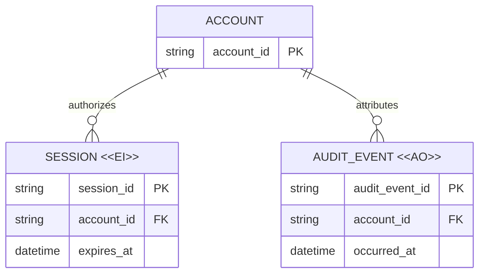

# Business Data Model Review

Communicate the business meaning of a data change, not every storage detail.
The reviewer should understand the decision and its consequences in about five
minutes.

## Establish The Decision

1. Inspect the current domain model, persistence model, and relevant invariants.
2. State the requested decision in one to three bullets.
3. Summarize only material changes using Current, Proposed, and Why. Do not
   repeat general task background.
4. Identify the entities, ownership boundaries, relationships, keys, lifecycle
   rules, and migration effects that can change the decision.
5. Mark unknowns as open decisions rather than filling gaps with plausible
   schema details.

## Draw The Target Model

Use Mermaid `erDiagram` syntax for the target business model.

- Show cardinalities and relationship verbs, not disconnected table boxes.
- Include primary, foreign, or business keys only when they explain identity,
  ownership, uniqueness, or migration behavior.
- Include fields only when they carry reviewed semantics. Omit routine storage
  metadata and implementation-only columns.
- Split the model into complementary views when unrelated relationship groups,
  crossing lines, or dense entities slow comprehension. Name the question each
  view answers and state when a repeated box denotes the same entity.
- Keep request-scoped values, derived projections, caches, and operational
  records outside the durable entity model unless their lifecycle is part of
  the decision.

This is a business model first. Put physical table names, indexes, adapter
details, and rollout mechanics in a short persistence or migration section only
when they affect approval.

## Mark Lifecycle Semantics

Use these stereotypes when they apply:

- `<<AO>>` - Append Only. Normal domain operations insert records and do not
  update or delete them. State any separate retention purge or correction-by-
  compensation policy.
- `<<EI>>` - Ephemeral Immutable. Identity and binding are fixed after issue;
  rotation creates a replacement, while an explicitly described expiry,
  revocation, or pruning mechanism ends validity or retention.
- Unmarked - Mutable under the stated business rules.

Mermaid ER entities need stable identifiers for relationships. Put the visible
stereotype in an entity alias and escape angle brackets so renderers preserve
it:

Follow the diagrams with a compact lifecycle table for stereotyped entities
and any surprising mutable entity. State what can change, how validity ends,
whether deletion is allowed, and why the rule matters. A stereotype without
these concrete semantics is decoration, not a reviewable contract.

## Explain Only Governing Rules

After the diagrams, record the smallest set of rules needed to interpret them:

- ownership and authority boundaries;
- uniqueness and identity rules;
- mutations that must be atomic;
- historical attribution and retention behavior;
- one-way migration, compatibility, rollback, or canonicalization rules;
- important concepts intentionally not modeled as durable entities.

Prefer three to seven high-impact invariants. Move field dictionaries, full DDL,
query plans, exhaustive migration steps, and validation logs to linked sources
or a clearly secondary appendix.

## Validate The Artifact

1. Render every Mermaid block with the repository's renderer or Mermaid CLI.
2. Visually inspect labels, literal `<<AO>>` and `<<EI>>` stereotypes,
   cardinalities, relationship verbs, and line crossings.
3. Cross-check diagram keys and relationships against the prose invariants and
   current source model.
4. Confirm each migration statement preserves or deliberately changes
   identity, ownership, history, and compatibility.
5. Report rendering or source checks that could not be performed.

## Present For Review

Keep the primary artifact in this order:

1. Decision requested.
2. Material changes and reasons.
3. Target ER view or views.
4. Lifecycle semantics and key invariants.
5. Migration impact and unresolved decisions, when applicable.

End with an explicit approval question that names the model decision, rather
than a generic request for feedback.

Do not turn the review artifact into an architecture document, implementation
plan, schema dump, or transcript of the analysis that produced it.