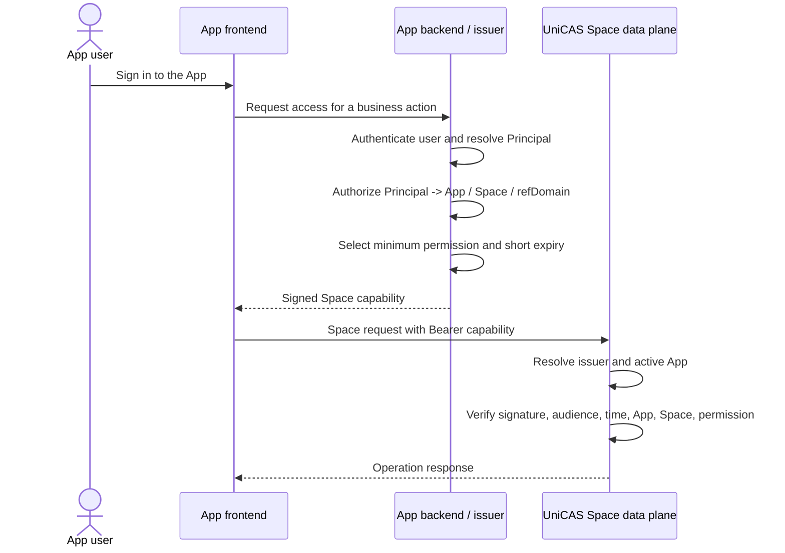
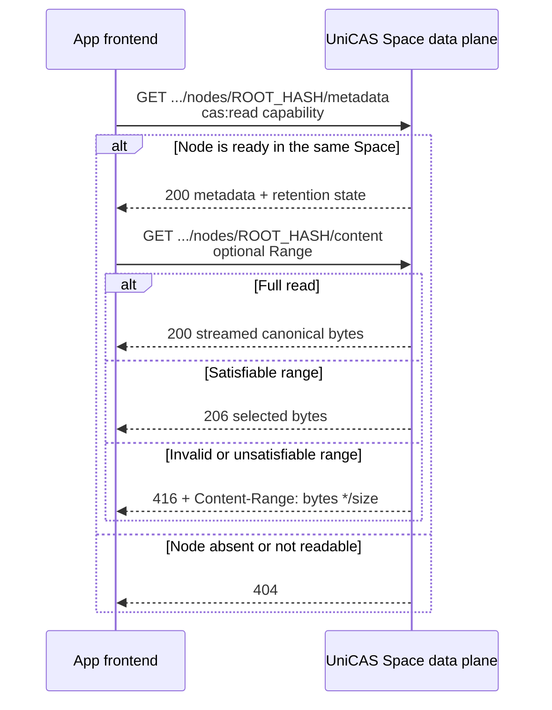
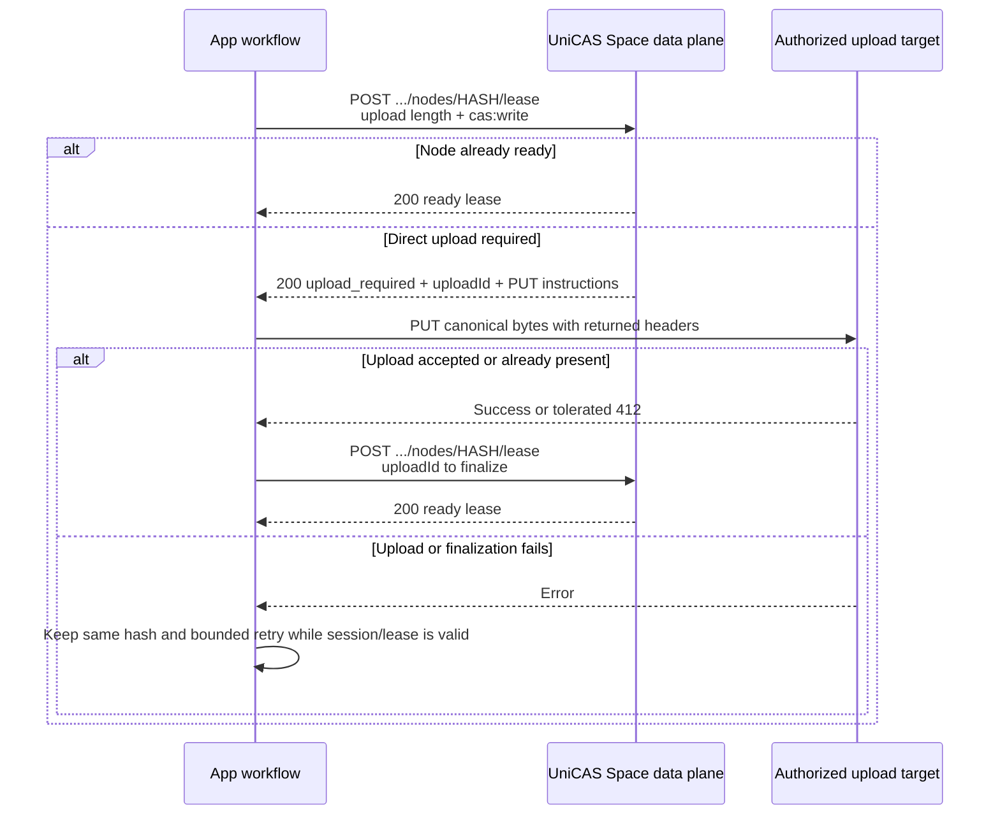
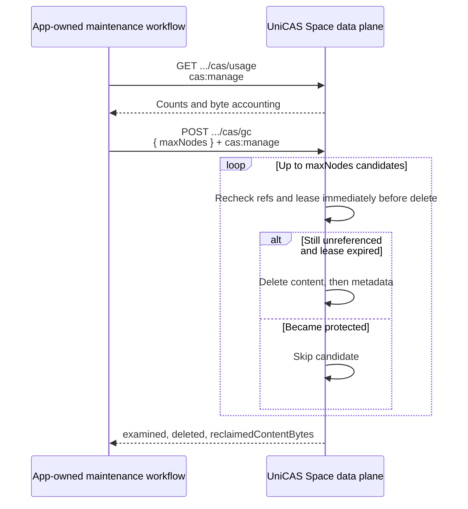

# Scenarios and sequences

Status: Interface review draft

These sequences use placeholders such as `APP_ID`, `SPACE_ID`, `ROOT_HASH`, and
`CAPABILITY`. They contain no production identity or bearer material.

## Acquire a least-privileged capability

The App authenticates its own user and authorizes the business action before
choosing any capability claims. UniCAS does not authenticate the App user and
does not provide Space enumeration for that user.



If the capability is expired or otherwise invalid, the App frontend returns to
its backend for a newly authorized capability. It must not retry with broader
permissions or an administrator credential.

## Read metadata and streamed content

Read metadata first when the App needs size, media type, child refs, or
retention state. Content is streamed and may be read in a byte range.



GET operations are safe to repeat, but callers should still use cancellation
and bounded retry policy. Retry transient transport or server failures; do not
retry `401`, `403`, or an unsatisfiable range unchanged. The public client does
not implement a general automatic retry loop.

## Upload an immutable node and acquire a lease

The hash is the lowercase SHA-256 digest of canonical node bytes. A lease
protects the preparation window; it is not a durable business reference and
does not imply that content is ready.



The endpoint also supports a single request carrying the canonical bytes,
`Content-Type`, and `Content-Length`. A missing required content length is
rejected. Hash mismatch, malformed content, conflicting active upload length,
expired upload session, and unready child references are explicit failures.

The published client supports direct prepare/upload/finalize orchestration. It
tolerates upload `412` as an already-satisfied upload step, then finalizes. It
does not promise general automatic retries.

## Atomically commit or release Root Refs

A business state transition is one atomic `changes` map. Moving authority from
one root to another must be `{ oldHash: -1, newHash: +1 }` in one request, not
two requests.

```mermaid
sequenceDiagram
    participant App as App backend
    participant CAS as UniCAS Space data plane

    App->>CAS: POST .../root-refs<br/>requestId + changes + cas:write + refDomain
    CAS->>CAS: Validate all hashes, readiness, balances, and domain revision
    alt First successful commit
        CAS-->>App: 200 success, idempotent=false, revision
    else Same requestId and same canonical payload
        CAS-->>App: 200 success, idempotent=true, original revision
    else Same requestId with different payload
        CAS-->>App: 409 IDEMPOTENCY_CONFLICT
    else Missing/unready node or negative aggregate
        CAS-->>App: 404 or 409; no partial commit
    else Internal revision race
        CAS->>CAS: Bounded retry with backoff
        CAS-->>App: One atomic outcome
    end
```

If the client loses the response, retry the exact same canonical request with
the same `requestId`. Never reuse a `requestId` for different changes.

To inspect committed state, page through `GET .../root-refs` with a
`cas:read` capability carrying the same `refDomain`. Pages are revision-stable;
the response returns the domain and revision alongside the next cursor.

## Inspect usage and run bounded garbage collection

Usage and collection require `cas:manage`; read or write capability alone is
insufficient.



The default bound is 100 nodes when `maxNodes` is omitted. A pass is advisory:
it may leave more eligible work, so schedule additional bounded passes rather
than assuming one call empties the Space.

## Retention model

A ready node survives while at least one protection applies:

- a positive Root Ref balance;
- a child reference from a protected graph; or
- an unexpired lease.

GC eligibility requires no child refs, no Root Refs, and an expired lease. The
collector rechecks eligibility immediately before deletion to avoid racing a
new reference. Root Ref commit is the durable state boundary; leases exist to
protect uploads while that commit is prepared.

Lease duration defaults to 15 minutes and is clamped to 60 seconds through 24
hours. Renewing an active lease preserves its original start and never shortens
its expiry.

See [State protection and garbage collection](../cas-state-protection-and-gc.md)
for the full accepted model.

## Failure and retry rules

| Outcome | Caller action |
| --- | --- |
| `401 missing_token`, `invalid_token`, `unknown_issuer` | Stop the Space call. Re-authenticate or obtain a newly authorized capability through the App. |
| `401 registry_unavailable` | Treat as a temporary authorization dependency failure; retry with backoff without changing authority. |
| `403 APP_SUSPENDED` | Stop. App administration must resolve suspension outside the user flow. |
| `403 resource_scope_mismatch` | Treat as a caller bug or attempted cross-resource use. Do not rewrite route identifiers from token data. |
| `403 insufficient_permission` | Stop. Request a new capability only after the App independently authorizes the broader action. |
| `404` | Do not assume a different Space. Resolve the App-owned catalog or upload state. |
| `409` upload or Root Ref conflict | Resolve the named conflict; replay only when the operation's idempotency rules allow it. |
| `413` | Reduce payload or follow the configured upload limit; retries with the same oversized body will fail. |
| `416` | Correct the range using the returned total size. |
| `500` or transport failure | Use bounded exponential backoff and preserve operation identity. For Root Refs, retain the same `requestId`. |

Authorization caches issuer authority for a short interval. A registry outage
may use known authority within a 60-second hard-stale window and emits stale
telemetry; after that bound the service fails closed with
`registry_unavailable`.
