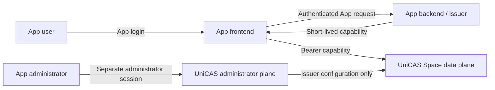

# App-user API

Status: published integration guide

This guide is for teams building end-user experiences on the UniCAS public v1
Space API. It explains how an App authenticates its own users, maps business
Principals to Spaces, issues least-privileged capabilities, and uses immutable
CAS nodes plus atomic Root Refs without exposing administrator credentials.

## Reading path

1. Read this page for the actors, trust boundaries, and ownership split.
2. Follow [Scenarios and sequences](scenarios.md) for complete request flows.
3. Explore the [interactive API reference](/app-user-api/reference/) for
  OpenAPI schemas, examples, and client snippets.
4. Use [HTTP operation reference](http-api.md) for runtime behavior and known
  contract gaps across all seven public operations.
5. Use [Capability authorization](authorization.md) for claims, permissions,
  denial behavior, and least-privilege examples.
6. Use [Prototype v2 migration](migration-v2-to-v1.md) when updating an
  existing pre-release integration.

Machine-readable sources remain authoritative:

- [App/Space v1 contract](../../../space-protocol/src/space-contract.ts)
- [Generated App/Space v1 OpenAPI](../../../space-protocol/openapi/app-space-v1.openapi.json)
- [Capability vocabulary](../../../space-protocol/src/space-capability.ts)
- [`@unicas/space-client` transport](../../../space-client/src/client.ts)

The guide explains those sources; it does not define a second schema.

## Capability contract at a glance

The route version and capability version are intentionally independent:

- public Space routes use `/v1/apps/{appId}/spaces/{spaceId}`;
- released Space capability claims use family-local `ver: 1`;
- the required signed `spaceId` is the capability's sole Space scope; and
- every operation requires one exact permission from the following set.

```text
cas:nodes:read
cas:nodes:lease
cas:root-refs:read
cas:root-refs:update
cas:usage:read
cas:gc:execute
```

Permissions do not imply one another. Both Root Ref permissions additionally
require a valid signed `refDomain`. Prototype Space capability versions 2 and
3 and their broad permissions are rejected without a compatibility cutoff.

## Actors and trust boundaries

| Actor | Trust and responsibility |
| --- | --- |
| App user | Authenticates to the App. The user never receives an App administrator session or credential. |
| App frontend | Presents the App experience. It requests short-lived capability delivery through an App-controlled authenticated flow and calls the Space API only with authority intentionally delegated to it. |
| App backend or issuer | Authenticates App users, resolves the business Principal, selects allowed App and Space identifiers, chooses a `refDomain`, and signs short-lived capabilities from the App's configured issuer. |
| UniCAS Space data plane | Verifies the bearer capability and server-side App state, enforces exact App, Space, permission, and `refDomain` boundaries, and performs CAS operations. |
| App administrator | Configures the App and its external OAuth issuer through the separate administrator plane. Administrator credentials never participate in an App-user API request. |



The data-plane security boundary is server enforcement, not whether a client
hides an operation. A caller cannot expand authority by changing route
identifiers, request headers, or client-side UI state.

## Resource and identity distinctions

- **App user** is an identity understood by the integrating App.
- **Principal** is the App's stable business subject for its own authorization
  and sharing model.
- **App** is the top-level UniCAS trust, administration, issuer, audit, and
  storage namespace.
- **Space** is an App-scoped data isolation and usage boundary. It is not a
  synonym for a user.
- **Root Ref domain** is a capability-selected namespace for committed Root Ref
  balances and revision ordering.
- **App administrator** configures the App through a separate control plane and
  is not an end user of the Space API by virtue of that administrator session.

One Principal may map to one Space, many Spaces, or a shared Space. Multiple
Principals may share a Space. UniCAS does not enumerate Spaces for an App user
or decide this mapping.

## What the App owns

The App, not UniCAS, owns:

- end-user sign-in, sessions, account recovery, and user lifecycle;
- Principal identifiers and Principal-to-Space mapping;
- sharing, membership, and business authorization before capability issuance;
- secure delivery and refresh of short-lived capabilities;
- selection and lifecycle of `refDomain` values;
- the business root catalog that maps application objects to CAS root hashes;
- file, document, folder, manifest, and other application data formats;
- decisions about when a Root Ref becomes authoritative or may be released;
- orchestration, retry budgets, cancellation, and user-facing error handling;
- audit correlation between an App user action and the capability `sub`/`jti`.

UniCAS owns validation and enforcement of the supplied capability, immutable
node integrity, lease protection, atomic Root Ref accounting, Space usage, and
bounded race-safe collection.

## Setup boundary

Before App-user traffic begins, an App administrator configures the App's
external OAuth issuer, audience, verification material, and capability lifetime
through the administrator plane. App-user request paths then use only
short-lived Space capabilities issued by that configured authority.

Do not:

- send administrator cookies, CSRF tokens, API credentials, or setup responses
  to the App frontend as Space credentials;
- mint a capability in the browser with an administrator secret;
- accept `appId`, `spaceId`, permissions, or `refDomain` directly from an
  untrusted browser without App-side authorization;
- use an administrator API as a substitute for an App-owned Space catalog.

See [Domain topology](../domain-topology.md),
[Terminology](../terminology.md), and
[Package boundaries](../../../README.md) for the surrounding accepted
architecture.

## Minimal integration shape

1. Authenticate the user to the App.
2. Resolve an App-owned Principal and the allowed Space.
3. Choose only the permissions required for the immediate workflow.
4. Add a valid `refDomain` only when listing or updating Root Refs.
5. Issue a short-lived capability for the configured UniCAS audience.
6. Deliver it over the App's authenticated channel.
7. Call `https://api.unicas.work/v1/apps/{appId}/spaces/{spaceId}/...`.
8. Treat Root Ref commit, not upload completion, as the durable business-state
   boundary.
9. Refresh expired capabilities through the App; never turn authorization
   failures into automatic privilege escalation.

The thin public transport package accepts a token callback and exposes the
seven operations described in this guide. Higher-level blob and file clients
may be used when their business abstraction matches the App, but their package
behavior does not add Space API authority.

## App-user SDK beta packages

The public SDK is an ESM-only, unified-version beta set:

```text
@unicas/codec
@unicas/space-protocol
@unicas/space-client
@unicas/space-blob-client
@unicas/space-browser-cache
@unicas/space-file-client
```

Install only the layers an App needs, using the `beta` dist-tag during beta:

```sh
npm install @unicas/space-client@beta
```

The browser cache is browser-only. The other packages support Node.js 24+ and
modern browsers with the documented Web APIs. Package semver, HTTP path `v1`,
capability claim version `1`, and beta product maturity are independent. Every
package in one SDK release uses the same exact version; package-root imports
are public, and `@unicas/space-protocol/openapi.json` is the only public
subpath.

## Compatibility and source-of-truth rules

This guide documents only released App/Space v1 routes under
`/v1/apps/{appId}/spaces/`. It does not reinterpret historical routes, tokens,
or storage names.

When sources differ:

1. the TypeScript protocol and generated OpenAPI define the published
   machine-readable surface;
2. service authorization and behavioral tests establish enforced runtime
   behavior;
3. client behavior describes what the published client can send or consume;
4. this guide reports any gap explicitly rather than inventing a normalized
   contract.

Current gaps are listed in [HTTP operation reference](http-api.md#contract-gaps).
