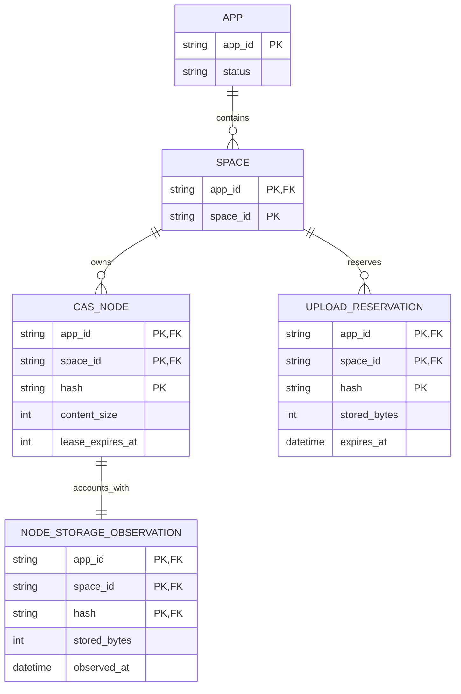

# Business and data model review

Status: Pending requesting-user approval.

## Decision requested

Approve these target business rules:

- App usage is a request-scoped aggregate derived from Space-owned node and
  upload-reservation state; it is not a new ownership or billing entity.
- Identical content hashes remain independently accounted in each Space.
- A durable node-level storage observation records the service-verified R2
  size so App totals can be read without an R2 scan; incomplete migration or
  repair state fails closed instead of producing a partial total.

Approval permits the additive projection and migration described below after
the interface and architecture reviews are also approved.

## Material changes

| Current | Proposed | Why |
| --- | --- | --- |
| A node row records logical size while Space usage discovers physical size with one R2 `HEAD` per node. | Each node row also carries its last completed canonical-object observation: observed time and nullable stored bytes. | One indexed D1 aggregate can serve App usage without cross-Space or per-node R2 fan-out. |
| No durable fact distinguishes an unprocessed legacy node from a verified missing object. | `observed_at IS NULL` means migration/repair is incomplete; `observed_at IS NOT NULL AND stored_bytes IS NULL` means the object was checked and missing. | Partial backfill must not masquerade as exact physical usage. |
| Usage is calculated for one `(appId, spaceId)` partition. | The Admin read sums rows by exact `appId`; Space remains the ownership key and duplicate hashes remain separate rows. | Administrators need an App total without exposing Space capabilities or identifiers. |

## Target model

`SPACE` is a logical ownership boundary, not a new registry table. The
`NODE_STORAGE_OBSERVATION` is shown separately to make its lifecycle
reviewable, but implementation may store its two fields directly on
`cas_nodes`. `AppUsage` is intentionally absent: it is a request-scoped sum,
not a durable entity, cache, quota, invoice, or historical snapshot.

## Lifecycle semantics

| Entity | What can change | How validity ends | Deletion |
| --- | --- | --- | --- |
| `CAS_NODE` | Hash, ownership, logical content size, and content type are immutable. Lease and Root Ref counters follow existing rules. | Existing GC eligibility rules. | GC removes the Space-owned row after canonical content deletion. |
| `NODE_STORAGE_OBSERVATION` | A successful canonical write or repair replaces observed time and stored bytes. A completed missing-object check stores a null byte value with a non-null observed time. | It is superseded by a later observation or removed with its node. | Never retained independently of the node. |
| `UPLOAD_RESERVATION` | Existing upload validation may replace stored bytes and deadlines for the same Space-owned hash. | Existing upload finalization or cleanup removes it. | Existing cleanup lifecycle only. |

## Governing invariants

1. `(appId, spaceId, hash)` identifies one Space-owned node. A matching hash in
   another Space is a distinct accounting row and contributes again.
2. Logical bytes, physical bytes, readiness, lease markers, and reservations
   retain the exact current Space usage meanings documented in
   [InterfaceDesign.md](./InterfaceDesign.md).
3. A new canonical node and its completed storage observation enter D1 in one
   batch after R2 accepts or verifies the canonical object. Failed D1 commit
   leaves an unowned R2 object, not a visible node with invented usage.
4. After R2 deletion succeeds, GC records the node as observed missing before
  its final D1 deletion. A crash between those operations can temporarily
  retain the prior observation; bounded repair re-observes and converges it.
5. A successful App report requires every selected node to have a completed
   observation. Unknown projection state returns service unavailable rather
   than zero bytes or a partial sum.
6. App membership authorizes only the derived aggregate. It does not alter
   App, Space, node, reservation, lease, Root Ref, or capability ownership.

## Migration and repair

The schema change is additive: add nullable `canonical_stored_bytes` and
`canonical_observed_at` fields to `cas_nodes`. New writes populate both fields.
Existing rows begin unobserved and are visited by a restartable bounded
reconciler using their exact App, Space, and hash key. Each R2 `HEAD` records
either the observed object size or an observed missing result.

The App endpoint returns `503 SERVICE_UNAVAILABLE` while any row for that App
is unobserved. Empty Apps remain immediately readable as zero. The reconciler
is idempotent, uses keyset pagination, and may safely resume after interruption.
Periodic bounded reconciliation repairs drift caused by an interrupted
R2/D1 transition. Rollback ignores the additive columns; no destructive data
migration is required.

## Review question

Approve App usage as a derived aggregate, independent per-Space accounting,
and the node-level storage-observation lifecycle with fail-closed backfill?