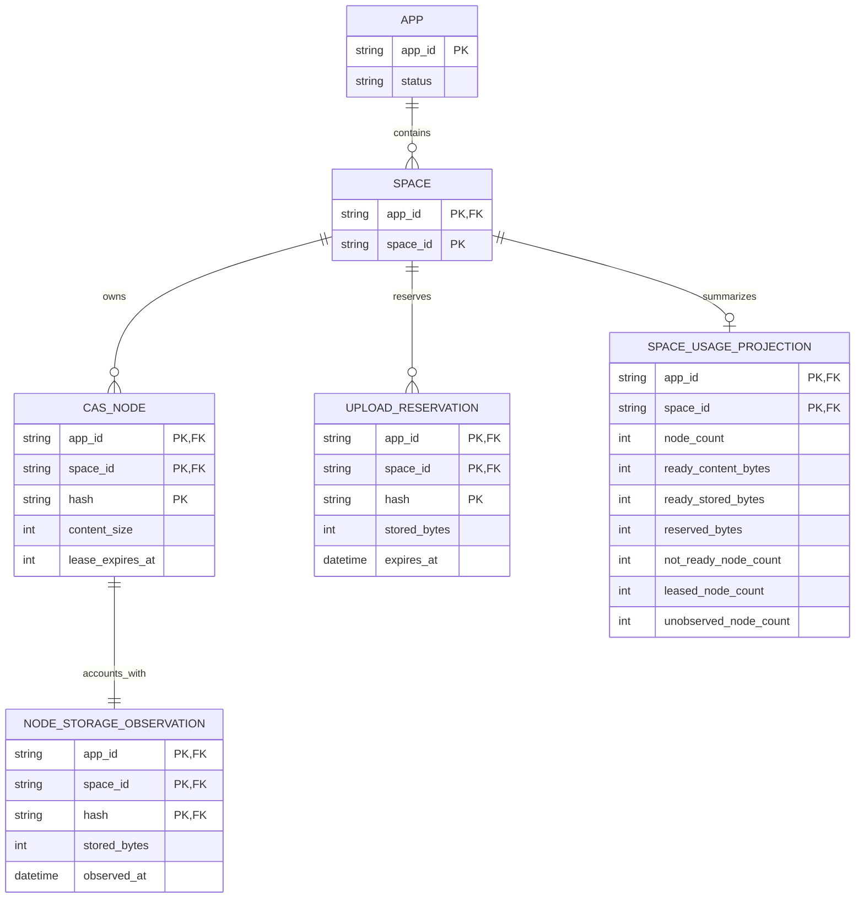

# Business and data model review

Status: Approved by the requesting user on 2026-09-21.

## Decision requested

Approve these target business rules:

- App usage is a request-scoped aggregate derived from Space-owned node and
  upload-reservation state; it is not a new ownership or billing entity.
- Identical content hashes remain independently accounted in each Space.
- A durable node-level storage observation records the service-verified R2
  size, and one mutable summary row per usage-bearing Space maintains its six
  counters. App reads sum Space summaries rather than node rows or R2 objects.
- Incomplete migration or repair state fails closed instead of producing a
  partial total.

Approval permits the additive projection and migration described below after
the interface and architecture reviews are also approved.

## Material changes

| Current | Proposed | Why |
| --- | --- | --- |
| A node row records logical size while Space usage discovers physical size with one R2 `HEAD` per node. | Each node row also carries its last completed canonical-object observation: observed time and nullable stored bytes. | Physical accounting becomes durable, auditable, and repairable without read-time R2 calls. |
| No durable fact distinguishes an unprocessed legacy node from a verified missing object. | `observed_at IS NULL` means migration/repair is incomplete; `observed_at IS NOT NULL AND stored_bytes IS NULL` means the object was checked and missing. | Partial backfill must not masquerade as exact physical usage. |
| Usage is calculated by scanning every node in one `(appId, spaceId)` partition. | One `SPACE_USAGE_PROJECTION` row per usage-bearing Space is updated atomically with node, lease, observation, and reservation changes. | App reads scan $O(S_{app})$ summary rows instead of $O(N_{app})$ node and reservation rows. |
| No App or Space usage rollup exists. | The Admin read sums Space summary rows by exact `appId`; there is no shared mutable App counter row. | Preserve Space writer ownership and avoid a cross-Space hot row while keeping reads independent of node count. |

## Target model

`SPACE` is a logical ownership boundary, not a new registry table. The
`NODE_STORAGE_OBSERVATION` is shown separately to make its lifecycle
reviewable, but implementation may store its two fields directly on
`cas_nodes`. `SPACE_USAGE_PROJECTION` is derived, mutable state rather than a
new ownership entity. `AppUsage` is intentionally absent: it is a
request-scoped sum of those rows, not a durable App counter, cache, quota,
invoice, or historical snapshot.

## Lifecycle semantics

| Entity | What can change | How validity ends | Deletion |
| --- | --- | --- | --- |
| `CAS_NODE` | Hash, ownership, logical content size, and content type are immutable. Lease and Root Ref counters follow existing rules. | Existing GC eligibility rules. | GC removes the Space-owned row after canonical content deletion. |
| `NODE_STORAGE_OBSERVATION` | A successful canonical write or repair replaces observed time and stored bytes. A completed missing-object check stores a null byte value with a non-null observed time. | It is superseded by a later observation or removed with its node. | Never retained independently of the node. |
| `UPLOAD_RESERVATION` | Existing upload validation may replace stored bytes and deadlines for the same Space-owned hash. | Existing upload finalization or cleanup removes it. | Existing cleanup lifecycle only. |
| `SPACE_USAGE_PROJECTION` | Counter deltas commit atomically with source mutations; repair replaces all counters from the Space's source rows. | All counters reach zero after the final node and reservation are removed. | A zero row may be removed; absence means zero usage. |

## Governing invariants

1. `(appId, spaceId, hash)` identifies one Space-owned node. A matching hash in
   another Space is a distinct accounting row and contributes again.
2. Logical bytes, physical bytes, readiness, lease markers, and reservations
   retain the exact current Space usage meanings documented in
   [InterfaceDesign.md](./InterfaceDesign.md).
3. A new canonical node and its completed storage observation enter D1 in one
  batch with its Space summary delta after R2 accepts or verifies the
  canonical object. Failed D1 commit leaves an unowned R2 object, not a
  visible node or summary with invented usage.
4. After R2 deletion succeeds, GC records the node as observed missing before
  its final D1 deletion. A crash between those operations can temporarily
  retain the prior observation; bounded repair re-observes and converges it.
5. Every normal node, lease, observation, and reservation mutation changes at
  most one Space summary row in the same D1 batch. No mutation from one Space
  writes another Space's row or a shared App counter.
6. A successful App report requires every selected Space summary to have
  `unobserved_node_count = 0`. Unknown projection state returns service
  unavailable rather than zero bytes or a partial sum.
7. The App query is proportional to the number of usage-bearing Spaces, not
  nodes. It performs no node scan, reservation scan, R2 call, or internal
  Space request.
8. App membership authorizes only the derived aggregate. It does not alter
   App, Space, node, reservation, lease, Root Ref, or capability ownership.

## Migration and repair

The schema change is additive: add nullable `canonical_stored_bytes` and
`canonical_observed_at` fields to `cas_nodes`, plus `cas_space_usage` keyed by
`(app_id, space_id)`. New writes populate node observations and update one
summary row in their existing D1 batch. Initial summaries group existing nodes
and reservations by App and Space, with their legacy nodes counted as
unobserved. A restartable bounded reconciler visits those nodes by exact App,
Space, and hash key; each R2 `HEAD` atomically records the observation and its
Space summary delta.

The App endpoint returns `503 SERVICE_UNAVAILABLE` while any Space summary for
that App has unobserved nodes. Empty Apps remain immediately readable as zero.
The reconciler is idempotent, uses an indexed bounded oldest-first scan, and
may safely resume after interruption. Periodic bounded repair recalculates one Space summary
from its node and reservation source rows, correcting any projection drift
without coordinating with another Space. Rollback ignores the additive table
and columns; no destructive data migration is required.

## Review question

Approve App usage as a derived aggregate, independent per-Space summary rows,
the node-level storage-observation lifecycle, and fail-closed backfill and
repair?