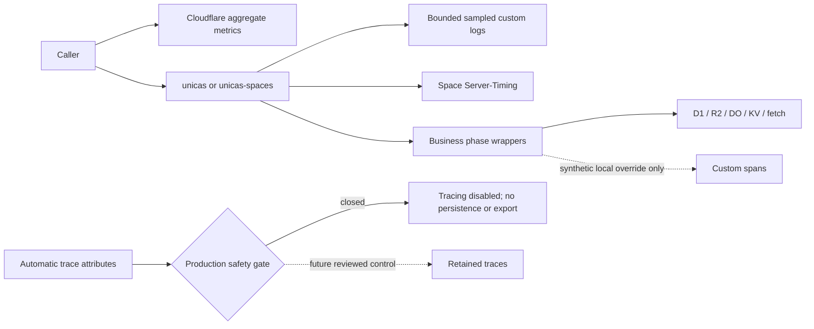

# UniCAS observability architecture review

Status: Pending review.

## Decision requested

Approve a fail-closed observability rollout that makes both dynamic Worker
configs explicit, sanitizes persisted custom logs, installs reviewed custom
span boundaries for synthetic investigation, and prevents automatic tracing
from being enabled or persisted in production.

Approval permits the configuration, adapter instrumentation, tests,
documentation, and repository-local skill described below. It does not permit
a production trace sample rate above zero or an external telemetry export.

## Runtime boundary

Cloudflare-specific tracing imports and wrappers stay in
`@unicas/service-cloudflare` and `@unicas/spaces`. The cloud-neutral
`@unicas/service` actor receives no Cloudflare dependency. A portable hook is
added only if a reviewed business phase cannot be bounded in its platform
adapter; the initial implementation should avoid that expansion.

## Configuration

`packages/service-cloudflare/wrangler.toml` and
`stacks/unicas/spaces/wrangler.jsonc` receive the exact nested policy from
[InterfaceReview.md](./InterfaceReview.md). Checked-in production generation
must preserve it byte-for-value for the Spaces deployment config.

Repository tests parse both configs and assert:

- logs enabled, 5% sampled, persisted, no destinations, and invocation logs
  disabled;
- traces disabled, zero sampled, not persisted, and no destinations;
- the product-site and documentation configs contain no observability block;
  and
- production Spaces config generation cannot override or drop the policy.

These assertions protect against Cloudflare's documented future plan to make
automatic tracing follow the top-level observability toggle.

## Safe logging adapter

Raw `Error` values and identifier-bearing interpolation are removed from the
two dynamic Workers' persisted log paths. A platform-local helper emits only a
static event name and explicitly supplied bounded fields. It does not inspect
or serialize the error message, cause, stack, request, response, or provider
payload.

Focused tests use canary values shaped as a bearer token, cookie/CSRF value,
OAuth code/state, private key, presigned URL, App/Space ID, node hash, object
key, path, SQL binding, and body content. Captured log output must include the
expected static event and exclude every canary. Existing bounded structured
events retain their current contract.

Local interactive diagnosis may inspect an error in a debugger. It must not
restore raw exception persistence as a shortcut.

## Custom spans

Use `tracing.enterSpan` for the four synchronous/async callback-shaped phases
approved in [InterfaceReview.md](./InterfaceReview.md). Do not use
`startActiveSpan` for response bodies or streams in the initial implementation:
the existing timing contract ends at response construction, and a manually
managed streaming span adds cancellation and lifecycle risk without solving
the automatic-attribute safety problem.

Span adapters set only enum outcomes and bounded numeric counts. Attribute
construction occurs only when `span.isTraced` is true. Unit tests inject a
recording adapter or use the Workers test runtime to verify names, nesting,
attributes, thrown-error propagation, and the no-op path. Production config
keeps the runtime unsampled.

## Investigation workflow and skill

The repository-local `.agents/skills/unicas-observability/SKILL.md` guides an
agent through:

1. selecting metrics, sampled structured logs, durable audit, or
   `Server-Timing` based on the question;
2. comparing Worker versions with aggregate CPU/wall/error metrics;
3. reproducing a Space request and reading bounded timing entries;
4. querying exact event names without printing identifiers or secret-bearing
   fields;
5. using only synthetic values for a local tracing override;
6. reviewing automatic provider attributes before adding a span or enabling
   persistence; and
7. validating config, tests, docs, dry runs, and secret-absence canaries.

The skill points to maintained repository files and current Cloudflare source
pages. It is repository-owned and is not added to `skills-lock.json` or the
admin CLI's remotely served skill asset.

## Validation and rollout

Implementation validation proceeds in this order:

1. config-policy and production-config-generation tests;
2. focused safe-log and custom-span tests;
3. existing `Server-Timing`, Worker, Spaces, and docs tests;
4. workspace typecheck/build and Repoledger checks;
5. `pnpm deploy:plan` and `pnpm deploy:spaces:plan` dry runs; and
6. after normal protected deployment, a synthetic retained-log canary probe
   and Cloudflare dashboard verification by an account operator.

The deployed probe must confirm a known bounded event was retained before its
negative secret search is accepted. It also verifies metrics by Worker version
and confirms that no trace events were persisted. Because production tracing
is intentionally off, it cannot supply the trace-waterfall evidence required
by the original task contract.

## Cost and retention

The checked-in 5% head sample is the initial event-volume control. The
Cloudflare plan supplies three- or seven-day maximum retention and, beginning
2026-10-01, shares event quotas/pricing across log events and trace spans.
There is no external destination and therefore no second retention boundary
or export charge.

Changing the log sample rate is a reviewed config change. Enabling invocation
logs, adding a destination, setting `persist = true` for traces, or setting a
nonzero trace sample reopens both interface and architecture review.

## Alternatives rejected

- A low trace sample does not prevent a credential-bearing request from being
  selected and is not a data-safety mitigation.
- `persist = false` with an OpenTelemetry destination exports the same unsafe
  automatic attributes and merely moves the disclosure boundary.
- Post-ingest dashboard filters cannot undo storage of a secret.
- A Tail Worker applies custom handling to log events but does not provide a
  documented pre-persistence policy for all automatic trace spans.
- Splitting every OAuth, identifier-bearing, D1, R2, KV, and Durable Object
  path into untraced deployment units would fragment the single-service
  architecture and still would not make the remaining binding attributes
  safe.
- Replacing native telemetry with a third-party or custom event pipeline is a
  separate outcome and is outside this task.

## Rollback

Rollback redeploys the previous Worker versions. The forward fix for a bad
observability config is to restore the reviewed explicit settings and redeploy;
no database, object, Durable Object namespace, or protocol rollback is needed.
If any prohibited value is found, immediately disable Workers Logs persistence
for the affected Worker, remove any destination, restrict operator access,
follow Cloudflare's supported deletion/escalation process, and treat the value
as potentially disclosed for its remaining lifetime.

## Acceptance impact

This architecture intentionally leaves the production-trace acceptance slice
open. Completing that slice requires a future provider control or a separately
approved topology outcome, refreshed reviews, deployment, and synthetic
secret-absence evidence. Repoledger completion must not be requested while
those criteria remain unmet.

## Review question

Approve the fail-closed configuration, platform-local instrumentation,
safe-log adapter, synthetic-only custom spans, validation/rollout sequence,
cost boundary, rejected alternatives, rollback, and provider-blocked
completion status?