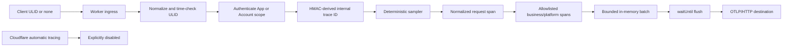

# Manual tracing architecture review

Status: Pending review.

## Decision requested

Approve replacing the blocked native-tracing outcome with an explicit manual
trace pipeline. Cloudflare aggregate metrics and sampled safe logs remain in
place, Cloudflare automatic tracing stays disabled, and one destination-neutral
OTLP/HTTP exporter sends only the fields approved in
[ManualTracingInterfaceReview.md](./ManualTracingInterfaceReview.md).

## Runtime flow



OAuth callbacks and other pre-authentication routes ignore caller trace input
and use server-generated identity. No OAuth code, state, verifier, callback URL,
or provider payload enters the manual context.

## Package boundaries

- `@unicas/service` owns only portable span names, context types, and optional
  instrumentation hooks needed around cloud-neutral business phases.
- `@unicas/service-cloudflare` owns ingress validation, HMAC derivation,
  deterministic sampling, context propagation, Worker/Durable Object adapter
  spans, batching, and OTLP transport.
- `@unicas/spaces` owns its request root, Google/UniCAS/R2 peer-enum spans, and
  propagation to the UniCAS service.
- Protocol and client packages may expose the optional correlation header and
  ULID helper, but do not depend on an OpenTelemetry SDK or exporter.

The existing `TracingPort` becomes a portable context-aware interface rather
than an alias for `cloudflare:workers` tracing. Native `ctx.tracing` and
`runtimeTracing` are removed from production manual tracing paths while the
Wrangler configuration continues to assert native tracing is disabled.

## Context propagation

At public ingress, only `X-Trace-Id` is accepted from the caller. UniCAS strips
all internal parent/context headers before routing. After authentication, the
adapter derives the scoped internal trace ID and creates a server-owned random
64-bit span ID.

For Worker-to-Durable-Object and Spaces-to-UniCAS calls, adapters propagate a
versioned internal context containing the canonical ULID, derived trace ID,
parent span ID, sampling decision, and an HMAC proof. The receiving adapter
validates the proof before accepting parentage; invalid context starts a new
server trace and never rejects the business operation.

The HMAC input also includes an out-of-band audience derived from the exact
destination method/path or Durable Object actor key. The audience is recomputed
from the authenticated route or trusted internal headers and is not serialized
into the carrier. A carrier replayed across an App route or actor therefore
fails verification. Input length is rejected before base64 decoding or JSON
parsing. This proof authenticates trace parentage, not the business request.

The shared trace HMAC key uses a versioned key ring so deployment can add a new
key, overlap for the maximum trace window, switch the active version, and later
remove the old key without breaking in-flight traces.

## Exporter

The exporter targets OTLP/HTTP and is configured only through deployment
configuration and Worker secrets:

```text
UNICAS_MANUAL_TRACE_SAMPLE_RATE=0
UNICAS_OTLP_TRACES_ENDPOINT=https://collector.example/v1/traces
UNICAS_OTLP_AUTHORIZATION=<secret>
UNICAS_TRACE_HMAC_KEYS=<versioned secret key ring>
```

The endpoint must use HTTPS and contain no userinfo, query, or fragment.
Authorization is sent in a header and never appears in source, logs, errors, or
span attributes. The destination must be selected before production export;
implementation can use a local mock OTLP receiver for tests.

Each invocation buffers at most 16 spans. A maximum-shape test sends the fixed
span and attribute vocabulary through the official serializer and requires at
most 32 KiB, retaining two-times margin under the 64 KiB serialized trace
contract. This is a checked structural bound rather than runtime coupling to
private SDK encoding.
One flush is scheduled with `waitUntil`; it has a one-second timeout, no retry
inside the request, and no response-body logging. Durable Object paths use the
Workers module-level `waitUntil` facility or hand the bounded batch to the
outer adapter. Unsampled requests allocate no span objects or export buffer.

Use a maintained OpenTelemetry OTLP encoder/exporter that bundles under the
Workers runtime. If the selected destination cannot accept the SDK's supported
OTLP/HTTP encoding, stop and reopen this review rather than hand-rolling a
provider-specific wire format.

## Instrumentation coverage

Instrumentation wraps only owned call sites, never raw binding proxies:

- ingress route matching emits normalized request operation;
- the existing timing wrappers emit D1, R2, and Durable Object phase spans;
- provider adapters emit peer-enum fetch spans without URL or response body;
- Spaces' upload fetch emits `r2_upload` without the presigned target;
- existing capability, node validation, Root Ref commit, and cleanup spans
  retain their reviewed attributes.

Request streaming spans end at the documented boundary. A response-construction
span is not represented as final-byte transfer time. Export work is excluded
from the measured request root.

## Replay and persistence assessment

This design adds no business entity, request ledger, schema, migration, or
retention change. Trace batches are ephemeral in Worker memory and leave the
repository boundary only through the reviewed OTLP destination.

No generic conflict lookup is performed for trace ULIDs. Cross-scope collision
is prevented by scoped HMAC derivation; same-scope reuse intentionally denotes
one logical trace. Business replay remains in existing payload-bound Root Ref
and control-plane idempotency repositories. Consequently the existing Business
and data model checkpoint remains not applicable.

If a future decision requires every request ULID to be atomically consumed,
that introduces an ephemeral immutable request-proof entity, retention and
pruning semantics, storage cost, failure behavior, and a public authorization
contract. Stop and run a separate business/data-model and security review.

## Validation

Focused tests must prove:

- ULID canonicalization, overflow rejection, clock bounds, and server fallback;
- deterministic scoped trace-ID derivation and key rotation;
- untrusted internal context cannot establish parentage;
- one ULID may be reused separately as an existing idempotency key without
  changing replay outcomes;
- unsampled paths allocate/export nothing;
- every exported key belongs to the allowlist and prohibited canaries are
  absent from serialized OTLP bytes;
- exporter timeout, rejection, oversized batches, and destination outage do
  not change business responses;
- representative Space, Admin, MCP, OAuth, Spaces, D1, R2, Durable Object, and
  error paths produce the expected bounded waterfall in a synthetic deployed
  environment; and
- Cloudflare automatic trace events remain absent.

Final rollout requires workspace checks, bundle dry runs, a destination access
and retention review, an isolated synthetic production-like probe, and explicit
approval of the exact nonzero sample configuration.

## Rollback

Set the manual sample rate to zero and redeploy. The business path must continue
without the exporter, and no schema or data rollback is required. Revoke the
destination authorization secret after disabling export if the destination is
suspected of receiving prohibited data.

## Open decision

Choose one operator-controlled OTLP/HTTP destination and record its region,
retention, access roles, deletion procedure, event pricing, endpoint format,
and credential-rotation process before implementation can be enabled in
production.

## Review question

Approve the scoped-HMAC trace identity, explicit context propagation,
allowlisted manual instrumentation, bounded fail-open OTLP exporter, no-new-
replay-ledger assessment, validation plan, and rollback boundary?