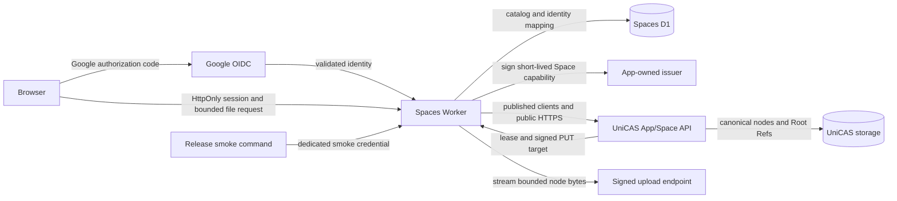

# Architecture review

Status: Pending requesting-user approval.

## Decision requested

Approve an independently deployable Cloudflare full-stack App at
`spaces.unicas.work` whose Worker owns identity, sessions, capability issuance,
catalog persistence, and file orchestration while using UniCAS only through its
published clients and public App/Space HTTP API.

Approval permits App scaffolding, Cloudflare resource configuration, and
release-workflow changes after the scope, business model, interface, and UI
reviews are also approved.

## Deployment and package boundary

```text
stacks/unicas/spaces/
|-- src/                 # Worker routes, OAuth, issuer, catalog adapters
|-- ui/                  # responsive React file UI
|-- migrations/          # App-owned D1 only
|-- scripts/             # bootstrap and non-interactive smoke
|-- wrangler.jsonc       # spaces.unicas.work, assets, D1, cron, observability
`-- package.json         # private workspace application
```

The App is not a package under `packages/` and is not bundled into
`@unicas/service-cloudflare`. Its allowed UniCAS dependencies are the published
protocol, transport, blob, and file clients. A boundary test rejects imports
from service implementations or admin clients, and a configuration test rejects
bindings to UniCAS-owned D1, R2, KV, or Durable Objects.

The App receives only its own static assets, D1 catalog, secret bindings, and
scheduled trigger. Signing keys, Google client secret, and smoke credential are
Cloudflare secrets. Non-secret issuer, audience, UniCAS base URL, App identity,
and bounded runtime settings are Wrangler variables.

## Trust and request flow



The browser never receives a UniCAS capability, signing private key, or
presigned PUT URL. The Worker uses the same public clients and HTTP routes that
an external backend can use; it receives no private service binding. File and
node sizes are bounded before buffering, and downloads are streamed through the
Worker rather than materialized as unbounded bodies.

## Authentication and capability issuance

1. `/auth/google/start` creates short-lived state, nonce, and PKCE material and
   redirects to Google.
2. `/auth/google/callback` validates state, issuer, audience, nonce, signature,
   and code exchange before resolving `(google, subject)` to an admitted App
   Principal. Email is display metadata, never identity or Space authority.
3. The Worker creates an opaque, hashed, expiring session and sets a Secure,
   HttpOnly, SameSite cookie. Logout revokes it server-side.
4. For each operation, the Worker loads the Principal-to-Space mapping and signs
   an audience-bound, short-lived capability for exactly that App, Space,
   permission set, and Root Ref domain.
5. UniCAS discovers the App issuer and JWKS at stable public routes under
   `spaces.unicas.work`. Private signing material remains in Worker secrets;
   rotation publishes overlapping public keys before changing the active key.

Microsoft and GitHub later add provider adapters at step 2. They bind their
stable provider subject to the same Principal model and do not alter Space,
catalog, session, or capability semantics.

## File and retention flow

- Upload uses `@unicas/tenant-file-client`, backed by the public blob and
  transport clients. Multi-node encoding and deterministic hashes remain owned
  by the published clients.
- Each Principal has one pre-created file-system Root. Explicit directories and
  file paths live in its immutable file manifest; the App D1 catalog stores the
  Root identity, current manifest hash, and optimistic revision, not one row per
  file.
- Folder creation uses `mkdir`, navigation uses `readdir`, uploads call `write`
  with a path under the selected folder, and file rename uses `move`. A single
  `commit` publishes each mutation as a new immutable manifest.
- Commit first retains the new manifest with a positive Root Ref, then updates
  the App catalog, then releases the replaced manifest according to the existing
  file-client contract. Unchanged file entries retain their existing blob
  hashes, so folder or file rename does not re-upload content.
- Download opens the Principal's cataloged Root and streams the selected path
  through public read operations. Delete uses `remove` and commits the next
  manifest; deleting the whole smoke Root releases its final Root Ref.
- Every smoke resource has a unique run identity and expiry. The command cleans
  in `finally`; a scheduled Worker sweep retries stale records with bounded
  work, so interrupted runs cannot accumulate indefinitely.

## Release ordering

```text
validate and build
-> deploy UniCAS service
-> run existing service smoke
-> deploy spaces.unicas.work
-> run Spaces auth/upload/commit/read/isolation/cleanup smoke
-> deploy product site
-> deploy documentation site
-> tag the successful production revision
```

Any Spaces deployment or smoke failure stops later promotion. Diagnostics name
only the run ID, stage, HTTP status, and stable error code. Production deployment
remains an explicit protected workflow action; local validation uses deployment
plans and Wrangler dry-runs.

## Failure recovery

- Failed OAuth validation creates no session or identity binding.
- Unknown identities receive a stable admission denial and trigger no admin API.
- Upload before catalog commit leaves only unretained immutable nodes, eligible
  for normal UniCAS garbage collection.
- A retained root without a completed catalog transition is recorded for
  reconciliation before success is returned.
- Folder creation, file move, and removal remain invisible until manifest commit;
  optimistic revision conflicts reload the Root and return a retryable conflict
  rather than silently overwriting a concurrent directory change.
- Cleanup is retry-safe. A partial smoke Root release remains queued until its
  positive Root Ref reaches zero and the catalog record can be removed.
- Rollback deploys the prior Spaces Worker. D1 migrations are additive through
  the initial release; destructive rollback is not part of the MVP.

## Rejected alternatives

- **Bundle the App into the UniCAS Worker:** hides the external integration
  boundary and risks private binding access.
- **Let the browser hold capabilities and signed PUT URLs:** expands secret-like
  exposure and complicates revocation without improving the smoke objective.
- **Provision Spaces during login:** requires runtime administrator authority
  and couples end-user authentication to the management plane.
- **Use Google as the UniCAS capability issuer:** Google does not issue the
  App/Space claims and permissions required by UniCAS.

## Review question

Approve this Cloudflare deployment boundary, Worker-mediated trust flow,
App-owned issuer/catalog, release ordering, and recovery model?
