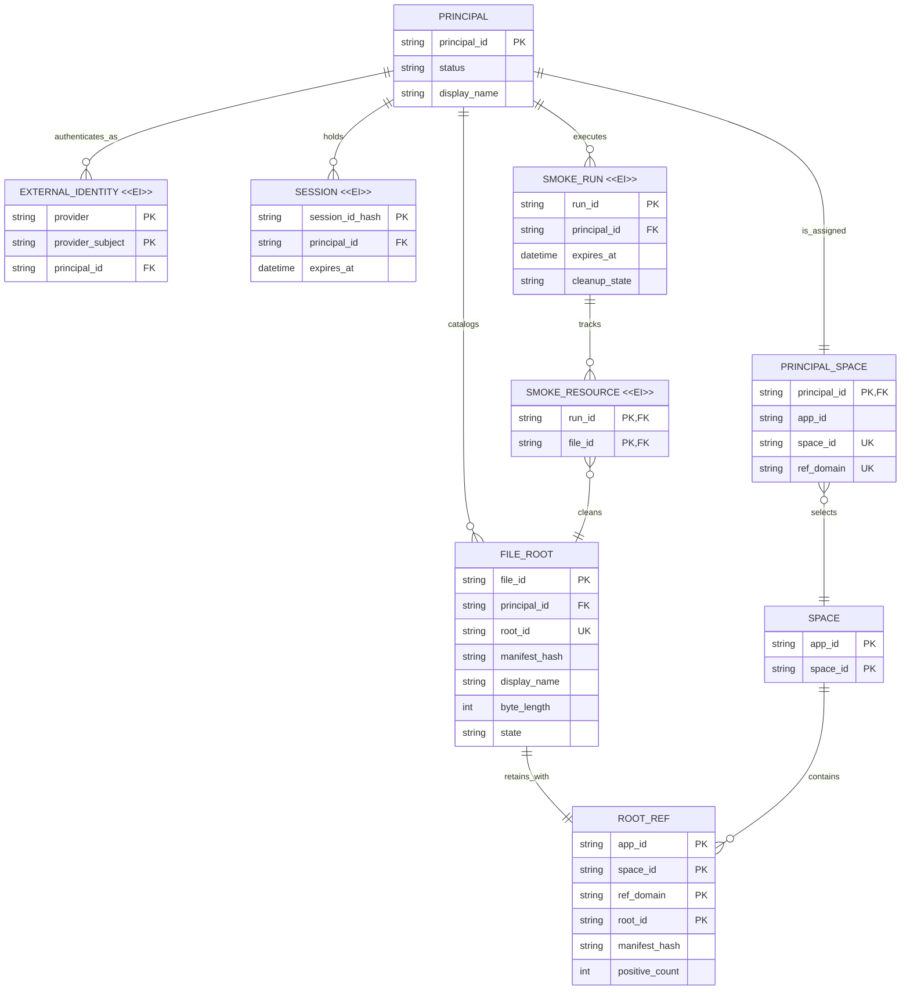

# Business and data model review

Status: Pending requesting-user approval.

## Decision requested

Approve these target business rules:

- Google, Microsoft, and GitHub identities bind to an App-owned Principal;
  Google is the only enabled MVP provider.
- A Principal maps to an explicitly provisioned Space. Provider identity,
  email, and Console membership never derive Space identity or authority.
- The App owns file names, catalog state, smoke-run cleanup, and capability
  issuance; UniCAS owns opaque canonical nodes and Root Ref retention.

Approval permits the App-owned D1 persistence and Root Ref lifecycle described
below after the other protected reviews are approved.

## Material changes

| Current | Proposed | Why |
| --- | --- | --- |
| No maintained file App or App-owned catalog exists. | Spaces D1 stores admitted Principals, provider bindings, Space mappings, file roots, sessions, and smoke cleanup records. | Business identity and file discovery belong to the App, not UniCAS. |
| Live smoke configuration supplies a capability externally. | The App authenticates a dedicated smoke Principal and issues the same bounded capability class used by its backend workflow. | Exercise real issuer and mapping boundaries without an admin session. |
| Provider support is unspecified. | External identity keys are `(provider, provider_subject)`; Google is enabled first and Microsoft/GitHub remain unavailable. | Add providers later without changing Principal or Space identity. |

## Target model

`SPACE` and `ROOT_REF` are UniCAS-owned business entities shown to explain the
boundary; they are not copied into App D1 beyond the identifiers needed for the
mapping and catalog. Canonical nodes, leases, edges, and content remain entirely
inside UniCAS and are intentionally absent from the App model. Capabilities and
presigned URLs are request-scoped values and are not durable entities.

## Lifecycle semantics

| Entity | What can change | How validity ends | Deletion |
| --- | --- | --- | --- |
| `EXTERNAL_IDENTITY <<EI>>` | Provider and subject never change; linking creates a new binding. Display claims may refresh on Principal. | Principal suspension or an explicit future unlink policy. | No self-service unlink in MVP. |
| `SESSION <<EI>>` | Identity and expiry are fixed after issue. | Logout, expiry, Principal suspension, or server revocation. | Expired/revoked rows are pruned. |
| `PRINCIPAL_SPACE` | Bootstrap or an explicit operator migration may replace the mapping; login cannot. | Principal suspension or mapping removal. | Operator-controlled; Root Refs must first be reconciled. |
| `FILE_ROOT` | Name and lifecycle state may change; root identity and committed manifest binding do not change in place. | Successful idempotent release and catalog deletion. | User delete or stale-smoke cleanup only. |
| `SMOKE_RUN <<EI>>` | Run identity, Principal, and expiry are fixed; cleanup state advances idempotently. | All tracked roots are released, or an actionable cleanup failure remains. | Pruned after bounded evidence retention. |
| `SMOKE_RESOURCE <<EI>>` | Binding is fixed after insertion. | Parent run cleanup releases the referenced root. | Removed after confirmed cleanup. |
| `ROOT_REF` | Positive count changes only through UniCAS atomic Root Ref updates. | Positive count reaches zero. | UniCAS retention and GC semantics apply. |

## Governing invariants

1. `(provider, provider_subject)` identifies at most one Principal; email is not
   a key and cannot authorize account linking.
2. MVP admission is pre-provisioned. Login cannot create a Principal, Space, or
   Principal-to-Space mapping and cannot call the UniCAS admin plane.
3. A Principal's file catalog resolves only through its assigned App, Space,
   and Root Ref domain. Cross-Space identifiers are rejected before data access.
4. A successful file catalog entry references one positively retained manifest
   Root Ref. A failed catalog transition leaves a reconciliation record rather
   than reporting success.
5. Deletion and smoke cleanup are idempotent and converge through retry; stale
   smoke records carry an expiry so scheduled cleanup is bounded and discoverable.
6. Signing keys, Google credentials, smoke credentials, capabilities, signed
   upload URLs, and uploaded bytes are never stored in App D1.

## Migration impact

This is a new App-owned database with no customer or Playground migration. The
initial schema is additive. Bootstrap inserts only dedicated non-customer App,
Space, Principal, identity-binding, and mapping identifiers after those
resources are explicitly created through supported control-plane operations.
Microsoft and GitHub enablement adds identity bindings and provider secrets; it
does not rewrite existing Principal, Space, file, or Root Ref identity.

## Review question

Approve this provider-neutral Principal model, pre-provisioned one-Principal to
one-Space mapping, App-owned catalog, and idempotent retention lifecycle?
