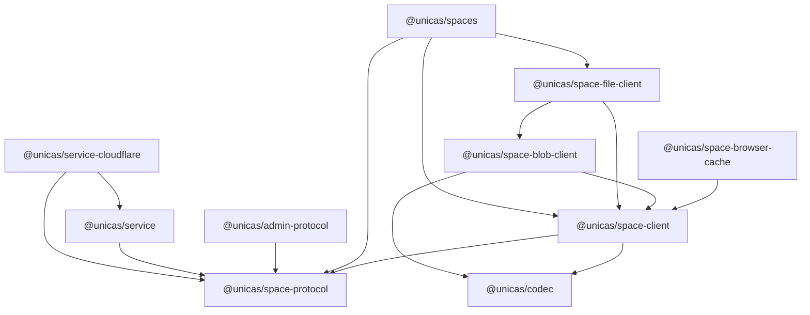

# Naming architecture review

Status: Approved by the requesting user on 2026-09-21.

## Decision requested

Approve one canonical App/Space naming architecture:

- Rename the five public data-plane packages from `tenant-*` to `space-*`.
- Keep App/Space v2 as the canonical protocol, client, service, and adapter
  vocabulary until the separate wire-version cutover task replaces it.
- Isolate frozen Stack/Tenant v1 routes, claims, factories, and tests behind
  explicit `v1` modules and ingress adapters.
- Carry `{ appId, spaceId }` through cloud-neutral kernels and Cloudflare
  repositories without translating current App/Space requests back to
  `stackId` or `tenantId`.
- Preserve physical schemas, object keys, Durable Object class names and
  identities, wire fields, and behavior.
- Record retained legacy terminology in one task-local, reason-bearing final
  inventory instead of adding a permanent repository guard.

Approval permits package, module, service, adapter, test, script, and current
documentation renames only after the companion interface review is also
approved.

## Invariants

- Frozen Stack/Tenant v1 HTTP routes, capabilities, OpenAPI, client behavior,
  and denial tests remain behaviorally unchanged.
- App/Space v2 routes, fields, permission strings, capability claims, and
  OpenAPI remain behaviorally unchanged by this naming task.
- Administrator and data access planes remain separate. The allowed protocol
  dependency stays one-way from Admin to Space.
- `@unicas/service` remains cloud-neutral and
  `@unicas/service-cloudflare` remains the only UniCAS deployment adapter.
- D1 already uses `app_id` and `space_id`; this task performs no schema or data
  migration.
- R2 keys, Durable Object binding names, class names, and identity derivation
  do not change. In particular, `CasDurableObject` remains the exported class
  even when its source file receives a Space-oriented name.
- Historical tasks, generated outputs, JavaScript error stacks, and external
  identity-provider vocabulary are not rewritten as UniCAS domain terms.

## Classified inventory

The review scan found the following maintained surfaces. File counts are a
planning baseline; the final one-time scan records the exact task-local
occurrence inventory.

| Surface | Baseline | Classification | Treatment |
| --- | ---: | --- | --- |
| Five `tenant-*` package directories and manifests | 5 packages, all `0.1.0` | Obsolete package family | Rename to `space-*` as one workspace cutover. |
| Source under the five packages | About 19 files containing Stack/Tenant terms | Mixed | Move frozen v1 names to explicit `v1` modules; rename current/shared code. |
| `packages/service/src` | About 16 files | Mixed | Retain v1 verifier names only in a v1 boundary; rename shared/current scopes. |
| `packages/service-cloudflare/src` | About 19 files | Mixed | Rename repositories and DO modules; keep only narrow ingress/control compatibility adapters. |
| Package manifests importing old specifiers | 9 manifests | Obsolete package references | Replace atomically and regenerate the lockfile. |
| Current source, tests, scripts, and docs importing old specifiers | About 64 files | Obsolete package references | Replace with `@unicas/space-*`. |
| Stack/Tenant v1 routes, headers, claims, permissions, and OpenAPI | Frozen compatibility surface | Frozen v1 | Retain unchanged behind explicit `v1` ownership. |
| Microsoft identity `tenantId` and provider `tid` | Provider-owned vocabulary | External standard | Retain only in provider-qualified files, types, and inventory entries. |
| Legacy control-plane payload/action translation | Narrow adapter surface | Compatibility adapter | Retain only where old control records or responses require translation. |
| `dist`, `*.tsbuildinfo`, Wrangler state, docs-site output, generated UI assets | Generated | Excluded | Regenerate from maintained inputs; do not classify generated text as source. |
| `tasks/**` | Historical record | Excluded | Do not rewrite or scan historical task artifacts. |
| `Error.stack` and stack traces | Language/runtime vocabulary | External standard | Match narrow runtime forms; never allow the bare word globally. |

Representative frozen v1 ownership:

- `/packages/space-protocol/src/v1/contract.ts`, `v1/http.ts`, and the v1 portion
  of `routes.ts` and `capability.ts`.
- `V1StackTenantCapabilityVerifier` and related claims in
  `/packages/service/src/v1/tenant-auth.ts`.
- `/stacks/{stackId}/tenants/{tenantId}`, `X-CAS-Stack-Id`,
  `X-CAS-Tenant-Id`, the v1 smoke path, and `tenant-v1.openapi.json`.

Representative obsolete internal names:

- `TenantCasClient*` at the canonical package root.
- `createTenantFileSystem` and the `TenantFile*` type family.
- `tenant-do.ts`, `NodeStore.stackId`, `NodeStore.tenantId`, and equivalent
  lease, read, usage, GC, and Root Ref repository scope fields.
- `listTenantRootRefs` and comments that describe current App/Space code as
  tenant-facing.

## Canonical package map

| Current directory and package | Canonical directory and package | Role |
| --- | --- | --- |
| `tenant-protocol` / `@unicas/tenant-protocol` | `space-protocol` / `@unicas/space-protocol` | Data-plane HTTP, capability, and shared protocol types. |
| `tenant-client` / `@unicas/tenant-client` | `space-client` / `@unicas/space-client` | Thin App/Space transport plus explicit frozen-v1 construction. |
| `tenant-blob-client` / `@unicas/tenant-blob-client` | `space-blob-client` / `@unicas/space-blob-client` | Blob workflow over the Space client. |
| `tenant-file-client` / `@unicas/tenant-file-client` | `space-file-client` / `@unicas/space-file-client` | File workflow and catalog ports scoped to a Space. |
| `tenant-browser-cache` / `@unicas/tenant-browser-cache` | `space-browser-cache` / `@unicas/space-browser-cache` | App/Space cache policy with an explicit v1 key adapter. |

`@unicas/codec`, all `admin-*` packages, both service packages, and the private
`@unicas/spaces` App keep their names. `Space` is preferred over
`data-plane` because it names the caller-owned resource already present in the
wire contract and public client; `data-plane` describes an architectural lane,
not a binding identity.

## Dependency boundary



The rename changes labels, not dependency direction. The workspace boundary
test continues to require directory/package-name identity, declared dependency
and import agreement, exact TypeScript references, and root workspace coverage.

## Protocol and client ownership

`@unicas/space-protocol` has two visible ownership boundaries:

```text
package root: current App/Space contract + shared neutral CAS types
./v1:         frozen Stack/Tenant contract and capability vocabulary
```

Maintained source is split accordingly rather than mixing both versions in
generic `routes.ts`, `http.ts`, and `capability.ts` files. The current Space
OpenAPI remains generated from the current contract, while the frozen v1
OpenAPI remains byte-stable unless its existing generator proves drift.

`@unicas/space-client` follows the same rule:

- The package root exports `createSpaceCasClient`, `SpaceCasClient*`, neutral
  `Cas*` transport types, and `CasClientError`.
- `./v1` exports `createTenantCasClient` and `TenantCasClient*` compatibility
  types.
- A v1 cache-key adapter converts once at construction; canonical cache and
  transport internals use App/Space names.

Blob APIs retain neutral `CasBlob*` names. File APIs rename
`createTenantFileSystem` and `TenantFile*` to `createSpaceFileSystem` and
`SpaceFile*`. Compatibility aliases are not kept at the canonical package
root.

## Service and adapter boundary

The canonical current request path is:

```text
App/Space route + verified Space capability
  -> AuthorizedSpaceCall { appId, spaceId }
  -> AppSpaceScope { appId, spaceId }
  -> cloud-neutral operation/repository ports
  -> Cloudflare repositories and CasDurableObject
  -> existing app_id/space_id rows and unchanged object keys
```

The frozen v1 path converts exactly once:

```text
Stack/Tenant v1 route + verified v1 capability
  -> V1StackTenantScope { stackId, tenantId }
  -> explicit v1 ingress adapter
  -> AppSpaceScope { appId: stackId, spaceId: tenantId }
  -> canonical shared implementation
```

The conversion does not imply a new alias route or cross-version authority.
Each verifier still accepts only its own route, claim version, resource
binding, headers, and permissions.

Cloudflare changes include renaming `tenant-do.ts` to `space-do.ts` while
retaining the neutral `CasDurableObject` export, replacing `NodeStore` and
repository scope fields with `{ appId, spaceId }`, and renaming current Root
Ref, node, usage, lease, read, and GC helpers. Provider-specific identity and
legacy control-record translation remain in named adapters.

## Final terminology inventory

Run one final source and filename scan and store its structured,
reason-bearing result in `TerminologyInventory.json` beside this review.

Each retained entry records:

```json
{
  "path": "packages/service/src/v1/tenant-auth.ts",
  "category": "frozen-v1",
  "pattern": "StackCapabilityVerifier",
  "reason": "Verifies the frozen Stack/Tenant v1 capability.",
  "removal": "Remove only with the dedicated v1 retirement task."
}
```

Allowed categories are `frozen-v1`, `external-standard`, and
`compatibility-adapter`. The one-time scanner walks maintained packages, scripts,
stacks, tests, root configuration, and current docs; it excludes `tasks`,
dependency directories, generated outputs, build metadata, and deployment
state by construction. Entries are exact path plus identifier or narrow text
pattern. Whole-package and whole-directory exemptions are rejected.

## Implementation order

1. Produce and verify the final task-local terminology inventory.
2. Split protocol source into canonical current and explicit v1 modules.
3. Rename all five packages, manifests, workspace dependencies, TypeScript
   references, import specifiers, lockfile entries, scripts, and build paths.
4. Rename client exports and move frozen-v1 client construction to `./v1`.
5. Rename cloud-neutral scopes and operation/repository port parameters.
6. Rename Cloudflare modules and scopes, retaining exact storage and Durable
   Object identities and narrowing compatibility adapters.
7. Update package rules, READMEs, glossary, architecture, current App-user
   docs, examples, deployment scripts, and the private Spaces consumer.
8. Regenerate OpenAPI and other tracked generated artifacts from source.
9. Run package, boundary, OpenAPI, documentation, workspace, typecheck, quick,
   exhaustive, v1, v2, and smoke validation.

Each stage lands only with a passing focused check. Package-directory renames
and their manifest/import/reference updates form one stage so the workspace is
never published with two package identities.

## Rollback

This task changes source names and build metadata, not persisted state. Before
release, rollback is a normal forward commit restoring the prior source map
and regenerating artifacts. No database, object, or Durable Object rollback is
required. After the beta package publication task runs, package identity is a
published compatibility concern and rollback must use a new version rather
than republishing or introducing an unreviewed alias.

## Review question

Approve the five-package `space-*` map, explicit frozen-v1 boundary,
App/Space-only current internals, unchanged persistence/DO identities,
reason-bearing final inventory, staged migration, and rollback strategy?