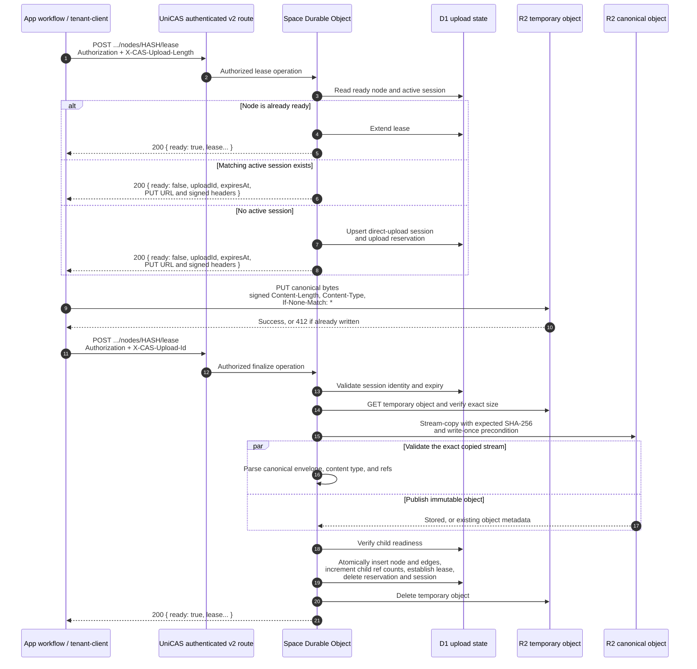
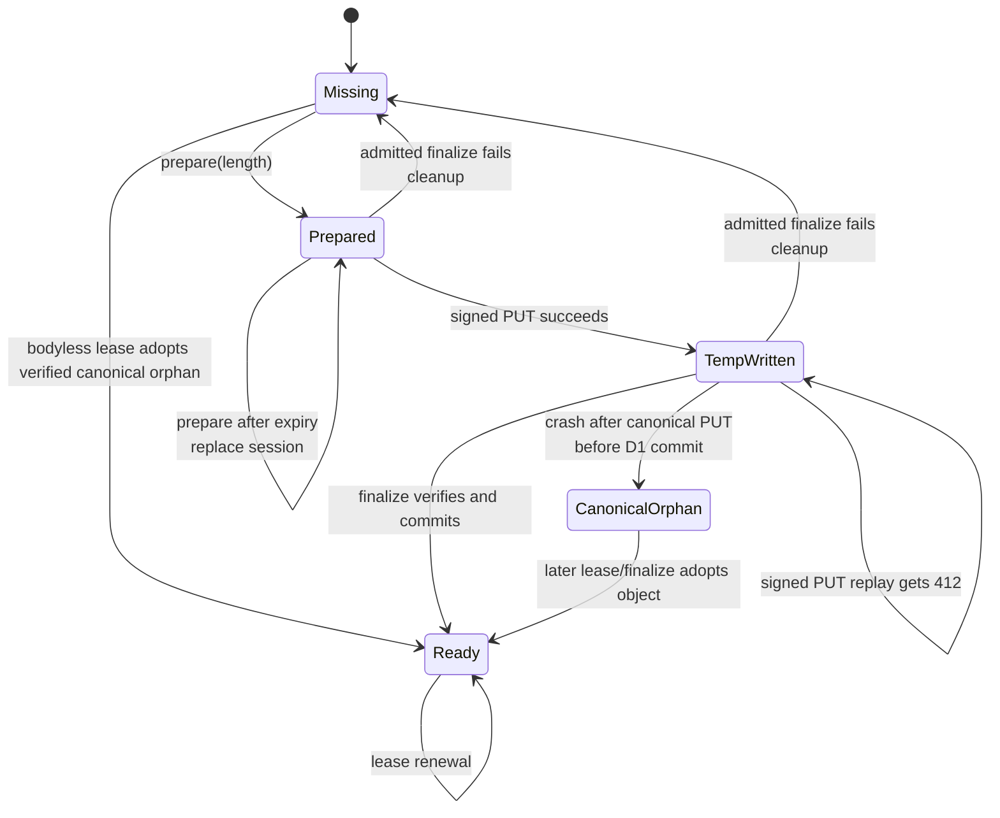

# Current three-phase node upload implementation

Updated: 2026-09-20

## Purpose

This document records the current implementation before any public API
transition is approved. It describes what the existing three-phase direct
upload path does, how it coexists with the older inline upload path, and where
the current contract remains ambiguous or incomplete.

The implementation sources are:

- [Space v2 contract](/packages/space-protocol/src/space-v2-contract.ts)
- [Tenant client](/packages/space-client/src/client.ts)
- [Cloud-neutral node lease kernel](/packages/service/src/node-lease.ts)
- [Cloudflare Space Durable Object](/packages/service-cloudflare/src/tenant-do.ts)
- [Cloudflare node lease repository](/packages/service-cloudflare/src/node-lease.ts)
- [R2 upload presigner](/packages/service-cloudflare/src/r2-upload-presigner.ts)

## Executive summary

The three phases already exist:

1. The App calls the authenticated Space `lease` endpoint with the canonical
   byte length to prepare an upload.
2. The App sends the canonical bytes directly to a short-lived, write-once R2
   URL without sending its App capability.
3. The App calls the authenticated `lease` endpoint again with the returned
   upload ID. UniCAS verifies and publishes the node, records metadata and
   edges, and establishes the lease.

However, this is not yet presented as one unambiguous public upload model:

- all three logical operations are encoded as modes of the same
  `POST .../lease` operation;
- the same operation still accepts an inline canonical body;
- `@unicas/tenant-client` uses inline upload by default and enables the
  three-phase path only with `uploadMode: "direct"`;
- OpenAPI represents one request with several optional headers and an optional
  body, while mutual exclusivity is enforced only at runtime; and
- there is no explicit cancellation operation or general expired-upload
  cleanup path.

## Public HTTP shape as implemented

All control requests use:

```text
POST /v2/apps/{appId}/spaces/{spaceId}/cas/nodes/{hash}/lease
Authorization: Bearer <App-issued capability>
```

The verified capability must grant `cas:write` for the exact App and Space.
The request mode is selected by headers:

| Request shape | Runtime meaning |
| --- | --- |
| `X-CAS-Upload-Length` | Prepare a direct upload. |
| `X-CAS-Upload-Id` | Finalize a prepared direct upload. |
| canonical `Content-Type` plus `Content-Length` and body | Perform the legacy inline upload. |
| none of the above | Renew a ready node's lease, or adopt a verified canonical orphan. |

The three mode-selecting headers are mutually exclusive at runtime. The
protocol schema does not express that exclusivity structurally.

## End-to-end sequence



## Phase 1: prepare

The caller sends `X-CAS-Upload-Length` and may send
`X-CAS-Lease-Duration`. The request has no canonical body.

The service first checks whether the node is already ready. If so, it renews
the lease immediately and returns the normal ready result; no upload session is
created.

Otherwise the service validates:

- `hash` is a canonical lowercase SHA-256 digest;
- upload length is a positive safe integer;
- upload length does not exceed the configured canonical-node limit; and
- no active session for the same App, Space, and hash has a different length.

For a new session, the service creates:

- a random `uploadId`;
- a random temporary R2 key under `_uploads/v1/`;
- a D1 `cas_direct_upload_sessions` row keyed by
  `(app_id, space_id, hash)`; and
- a matching `cas_upload_reservations` row that accounts for the bytes and
  fences the R2-before-D1 commit window.

The upload session lifetime defaults to 15 minutes. The presigned R2 URL
lifetime defaults to 5 minutes and is configured separately through
`CAS_UPLOAD_URL_EXPIRY_SECONDS`.

Prepare retry behavior is currently:

| Condition | Result |
| --- | --- |
| Node became ready | Return a renewed ready lease. |
| Same hash, same length, active session | Reuse the same session and return newly signed PUT instructions. |
| Same hash, different length, active session | `409 CAS_UPLOAD_CONFLICT`. |
| Existing session expired | Replace it with a new session and delete its previous temporary object. |
| Direct-upload signing is not configured | `503 STORAGE_ERROR`; the session reservation has already been written. |

The requested lease duration is stored in the upload session. Final publication
uses that stored value.

## Phase 2: direct object PUT

The prepare response contains:

```json
{
  "hash": "0123456789abcdef0123456789abcdef0123456789abcdef0123456789abcdef",
  "ready": false,
  "status": "upload_required",
  "uploadId": "opaque-upload-id",
  "expiresAt": 1760000900000,
  "upload": {
    "method": "PUT",
    "url": "https://presigned-r2-target.example/...",
    "headers": {
      "Content-Length": "1024",
      "Content-Type": "application/vnd.unidocs.cas-node.v1",
      "If-None-Match": "*"
    }
  }
}
```

The caller must use the returned URL and headers. This request goes directly to
R2 and does **not** carry the App capability or object-storage credentials.
Authorization is contained in the short-lived query signature.

The temporary key is not the canonical object key, so uploaded bytes are not
readable or referenceable through the Space API before finalize succeeds.
`If-None-Match: *` makes the temporary write write-once. The public client
treats HTTP `412` as a tolerable replay result and proceeds to finalize; the
finalize phase still verifies the stored bytes.

UniCAS is not involved while the body is transferred. Consequently, this phase
does not hold the Space Durable Object mutation gate or expose a long request
body to the Worker.

## Phase 3: finalize

The caller sends `X-CAS-Upload-Id` to the same authenticated `lease` endpoint.
The service:

1. returns a renewed lease immediately if the node is already ready;
2. otherwise requires the upload ID to match the active session;
3. rejects an expired session;
4. loads the temporary R2 object and requires its size to equal the prepared
   length;
5. tees the temporary object's stream;
6. parses the canonical header, content type, and ordered child hashes from one
   branch;
7. streams the other branch to the hash-addressed canonical R2 key with the
   requested node hash as the expected SHA-256 and
   `If-None-Match: *`;
8. if the canonical key already exists, verifies its size and stored checksum;
9. checks immutable metadata compatibility and requires every child node to be
   ready;
10. atomically commits the D1 node row, ordered edges, child reference-count
    increments, and lease while deleting the reservation and upload session;
    and
11. deletes the temporary object.

The canonical R2 object is written before the D1 ready-node transaction. This
is intentional. If the process fails in that interval, the verified canonical
object is an orphan rather than a falsely ready node. A later lease operation
can inspect and adopt that object.

Concurrent finalize requests for the same node are joined inside the active
Durable Object instance. After the first succeeds, later requests renew the
ready node. Ready-node detection happens before upload-ID validation, so once a
node is ready, the supplied upload ID no longer fences the lease renewal.

## Failure and cleanup behavior

| Failure | Current behavior |
| --- | --- |
| No temporary object or wrong temporary size | `412 CAS_UPLOAD_INCOMPLETE`; delete temporary object, session, and reservation. |
| Temporary bytes do not hash to `hash` | `422 CAS_DIGEST_MISMATCH`; delete temporary object, session, and reservation. |
| Canonical key already exists with different size or checksum | `409 NODE_CONFLICT`; delete temporary object, session, and reservation. |
| Canonical envelope or immutable metadata is invalid | `400`/`409`; delete temporary object, session, and reservation. |
| A referenced child is not ready | `409 NODE_NOT_READY`; delete temporary object, session, and reservation. |
| Upload ID is absent or wrong | `400 CAS_UPLOAD_INVALID`; leave the active session unchanged. |
| Session is expired | `410 CAS_UPLOAD_EXPIRED`; leave it for a later prepare to replace. |
| Failure after canonical object publication but before D1 commit | Canonical orphan remains adoptable by a later lease/finalize attempt. |
| Temporary-object deletion fails after D1 commit | The request can fail even though the node is ready; retry observes the ready node. |

There is currently no public cancel operation. The code explicitly deletes a
temporary object on successful finalize, failed admitted finalize, or
replacement of an expired session. The current implementation does not expose
a general sweeper that removes abandoned direct-upload session rows and
temporary objects solely because their deadline passed.

## How the public client selects the path

`createSpaceCasClient` and `createTenantCasClient` expose:

```ts
uploadMode?: "legacy" | "direct"
```

The default is effectively `"legacy"` because the direct branch is entered
only when `uploadMode === "direct"`.

With direct mode and a node source, `leaseNode` performs all three phases:

1. authenticated prepare;
2. direct PUT through `uploadFetcher` or the normal fetcher; and
3. authenticated finalize.

It obtains an App capability separately for prepare and finalize. It does not
send that capability to the upload target. The client has no general automatic
retry loop, does not expose the intermediate upload session to its caller, and
does not support resuming the orchestration after process failure.

Without direct mode, the same `leaseNode` call sends the entire canonical body
to the authenticated `lease` endpoint. The Worker then performs its own
internal reserve, R2 stream, validation, and D1 finalize sequence inside that
single HTTP operation.

The blob client delegates node writes to `leaseNode`, so its transport behavior
inherits whichever upload mode was selected when the lower-level client was
constructed. It currently materializes a contiguous canonical byte array
before calling the transport client.

## Current state model



`Prepared` is durable D1 state plus a quota/GC reservation. `TempWritten` is
not separately recorded; it is inferred by reading the temporary R2 key.
`Ready` is represented by the D1 node row together with the canonical R2
object. Only a positive Root Ref makes the node durable business state beyond
lease and graph protection.

## Why the API still looks like an integrated lease upload

The implementation has separated the data movement, but not the public
operation model:

1. Prepare, finalize, inline upload, and lease renewal share one route and one
   operation ID: `leaseSpaceNode`.
2. The request schema presents optional upload-length, upload-ID, content-type,
   content-length, and body fields rather than distinct request variants.
3. The operation summary remains “Lease or upload a node.”
4. The normal client configuration still chooses inline upload.
5. The direct session is hidden inside the client's `leaseNode` call, so an App
   cannot persist or resume it through the typed client API.
6. Cancellation and abandoned-session cleanup are not public lifecycle steps.

The next design discussion therefore needs to decide whether “three phases”
remain three modes of one lease endpoint or become explicit public operations,
and separately how much of the intermediate state the transport client should
expose to support retries and caller-owned recovery.
