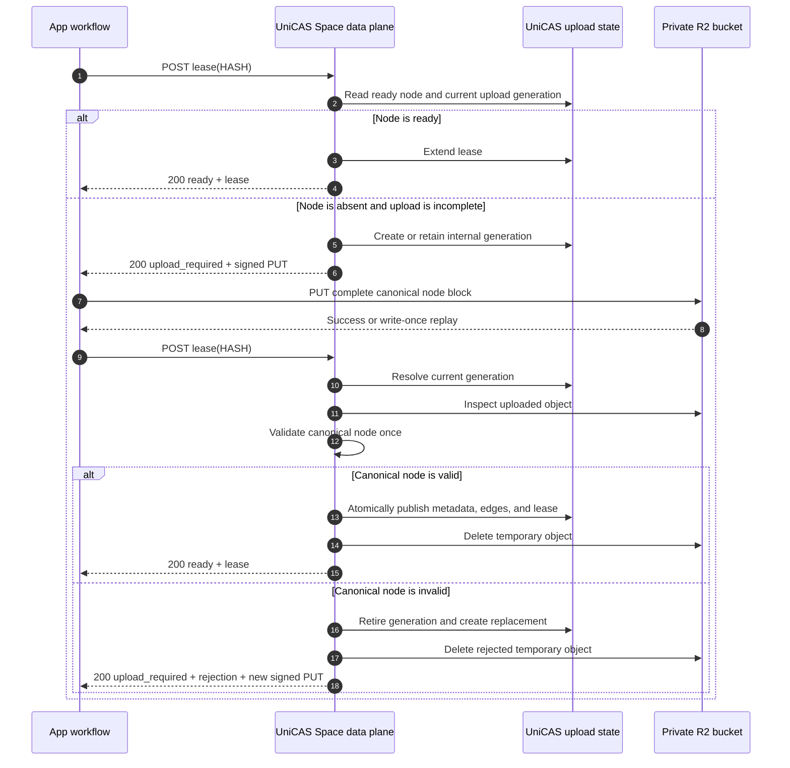

# Lease-driven direct node upload

Status: proposed for interface and architecture review

Updated: 2026-09-20

## Decision summary

The public v2 API has one node lease operation. A client always asks to lease a
hash and optimistically assumes that the node already exists. UniCAS returns a
ready lease when it does. When it does not, UniCAS returns short-lived direct
upload instructions.

After uploading, the client repeats the exact same lease request. UniCAS
observes its internal upload state and object storage, validates the canonical
node once, publishes it, and returns the lease.

The public request contains no canonical length, upload ID, body, or upload-mode
selector. Backward compatibility with the existing inline and header-selected
upload modes is intentionally not preserved.

## API

```http
POST /v2/apps/{appId}/spaces/{spaceId}/cas/nodes/{hash}/lease
Authorization: Bearer <capability>
X-CAS-Lease-Duration: 900000
```

The request is bodyless. `X-CAS-Lease-Duration` remains optional and is clamped
to the supported lease interval.

The caller needs only the node hash. It does not need to fetch metadata, know
the canonical object's length, or declare whether it can upload the node.

## Results

### Ready

```http
HTTP/1.1 200 OK
Content-Type: application/json
Cache-Control: no-store
```

```json
{
  "state": "ready",
  "hash": "0123456789abcdef0123456789abcdef0123456789abcdef0123456789abcdef",
  "leaseStartedAt": 1760000000000,
  "leaseExpiresAt": 1760000900000
}
```

This result means the node is validated, readable, referenceable by later
nodes, and protected from collection until the returned deadline.

### Upload required

```http
HTTP/1.1 200 OK
Content-Type: application/json
Cache-Control: no-store
```

```json
{
  "state": "upload_required",
  "hash": "0123456789abcdef0123456789abcdef0123456789abcdef0123456789abcdef",
  "reason": "node_missing",
  "upload": {
    "method": "PUT",
    "url": "https://presigned-upload-target.example/...",
    "expiresAt": 1760000300000,
    "headers": {
      "Content-Type": "application/vnd.unidocs.cas-node.v1",
      "If-None-Match": "*"
    }
  }
}
```

`upload_required` is a successful lease negotiation result that requires
caller action, not an asynchronously executing server job. It therefore uses
HTTP 200 rather than 202.

The response contains no upload ID, temporary object key, storage credential,
or App capability.

`reason` explains why this particular upload target was issued:

- `node_missing`: no prior upload generation existed;
- `upload_pending`: the current generation has no visible object yet;
- `upload_expired`: the prior generation expired and was replaced; or
- `previous_upload_rejected`: the prior object failed validation and was
  replaced.

For `previous_upload_rejected`, the response also carries an explicit,
publish-safe rejection:

```json
{
  "state": "upload_required",
  "hash": "0123456789abcdef0123456789abcdef0123456789abcdef0123456789abcdef",
  "reason": "previous_upload_rejected",
  "rejection": {
    "code": "NODE_DIGEST_MISMATCH",
    "message": "Uploaded canonical bytes did not match the requested node hash"
  },
  "upload": {
    "method": "PUT",
    "url": "https://replacement-upload-target.example/...",
    "expiresAt": 1760000600000,
    "headers": {
      "Content-Type": "application/vnd.unidocs.cas-node.v1",
      "If-None-Match": "*"
    }
  }
}
```

The replacement target uses a new internal generation and a new temporary
object key. The caller can therefore correct and upload the bytes immediately;
it is never asked to overwrite the rejected write-once object.

## Sequence



The first and post-upload lease requests are byte-for-byte equivalent apart
from ordinary authentication-token rotation.

## Canonical object

The direct PUT contains the complete canonical CAS node block:

```text
canonical node bytes =
    canonical header
  + UTF-8 content type
  + ordered child hashes
  + opaque content
```

The node identity is:

```text
hash = SHA-256(canonical node bytes)
```

It is not the hash of the opaque content alone.

For a non-leaf node, ordered child refs are therefore encoded in the R2 object
and covered by its hash. When the node becomes ready, UniCAS projects those
refs into D1 `cas_edges` rows and updates child reference counts.

R2 canonical bytes are the immutable source of truth. D1 metadata, edges, and
reference counts are rebuildable serving and garbage-collection projections.

## Server-owned state

UniCAS identifies the current upload by `(appId, spaceId, hash)` and may store:

```ts
interface InternalNodeUpload {
  readonly appId: string;
  readonly spaceId: string;
  readonly hash: string;
  readonly generation: string;
  readonly temporaryObjectKey: string;
  readonly createdAt: number;
  readonly expiresAt: number;
}
```

`generation` and `temporaryObjectKey` are internal fencing details. A unique
temporary key binds each signed URL to one generation. UniCAS only inspects the
temporary key of the current generation, so a late write through an obsolete
URL cannot publish into a newer generation.

The state does not store a client-provided length or lease duration. The lease
duration from the request that actually observes or publishes the ready node
controls the resulting lease.

## Lease algorithm

For each request, UniCAS performs:

```text
if a ready D1 node exists:
    verify its canonical object is present using the normal ready fast path
    extend the lease
    return ready

session = current internal upload state for (App, Space, hash)

if session does not exist or has expired:
    create a new internal generation and temporary key

object = inspect the current temporary key

if object is absent:
    return freshly signed upload instructions for the current key

if object is present:
    validate its size, digest, and canonical structure
    if those immutable checks fail:
        retire the current generation
        create a replacement generation and temporary key
        return upload_required with rejection details and the new target
    if a child is not ready:
        retain the validated object and return a retryable dependency error
    publish it exactly once
    establish the requested lease
    return ready
```

An in-instance single-flight keyed by `(appId, spaceId, hash)` joins concurrent
publication attempts. Durable generation fencing and write-once object keys
cover retries and process restarts.

## Validation boundary

The direct PUT stores an untrusted temporary object. It does not make the node
ready, readable, or referenceable.

The first lease request that observes a complete upload performs:

- the 32 MiB canonical-object size check;
- SHA-256 equality with the path hash;
- canonical binary envelope validation;
- content-size and content-type extraction;
- ordered child-ref extraction and limits;
- existing immutable metadata consistency, if applicable;
- child readiness checks; and
- atomic D1 node, edge, child-count, reservation, session, and lease updates.

After this transition, the node is ready. Later lease and positive Root Ref
operations do not parse or hash the canonical bytes again.

The validation scope is `(appId, spaceId, hash)`. This design does not introduce
global cross-Space validation or deduplication.

An immutable validation failure must not strand the caller behind the
write-once temporary key. In the same serialized lease operation, UniCAS
retires the rejected generation, creates a new generation and key, schedules
the rejected object for deletion, and returns `upload_required` with both the
rejection and replacement instructions. The replacement is durable before the
response is returned, so retrying the lease cannot rediscover the rejected
generation as current.

Child readiness is different from an invalid upload. The canonical bytes may
be valid while a referenced child is still being published. UniCAS retains the
validated temporary object and returns a retryable
`NODE_DEPENDENCY_NOT_READY` conflict. After the child becomes ready, repeating
the same parent lease request resumes publication without uploading the parent
again.

## Root Ref boundary

A positive Root Ref update accepts only ready nodes. It checks ready state and
reference-count constraints but does not recursively inspect the DAG.

This preserves bounded Root Ref transactions. Parent publication has already
validated children and projected edges, so child reference counts protect the
uploaded DAG before its final root becomes committed business state.

## Presigned upload constraints

The target must be:

- short-lived;
- scoped to one internal temporary object key;
- write-once;
- restricted to the canonical node media type;
- independent of the App capability; and
- free of reusable object-storage credentials.

The public request does not declare an exact content length. The 32 MiB limit
is therefore guaranteed at publication, not necessarily before bytes reach
R2. Before implementation, the R2 integration must verify whether a presigned
PUT can bind the expected SHA-256 checksum derived from the path hash while
remaining compatible with browser CORS and supported streaming bodies.

If provider checksum binding is supported, UniCAS should require it. This binds
the upload to the exact canonical object identity rather than only its length.

If it is not supported, the accepted residual exposure is:

- a holder of a short-lived URL may transfer an oversized temporary object;
- the object never becomes ready and is deleted when observed or expired;
- per-Space active-upload limits, short expiry, and cleanup bound temporary
  storage and request abuse.

The implementation must not describe the 32 MiB publication check as an
upload-time object-store limit unless the provider enforces it.

## Retry and recovery

| Situation | Lease result or action |
| --- | --- |
| Ready node | Extend lease and return `ready`. |
| Missing temporary object | Return a newly signed URL for the current generation. |
| Successful PUT followed by process failure | Repeating lease observes and publishes the object. |
| Repeated PUT to the same generation | Object store returns its write-once result; caller repeats lease. |
| Concurrent lease after upload | One request publishes; others join or observe ready. |
| Expired generation without an object | Rotate generation and return a new URL. |
| Expired generation with an object | Do not publish it; rotate and schedule the old key for cleanup. |
| Oversized or malformed object | Retire the generation and return `upload_required` with rejection details and a new write-once target. |
| Digest mismatch | Retire the generation and return `upload_required` with rejection details and a new write-once target. |
| Child not ready | Retain the validated object and return retryable `NODE_DEPENDENCY_NOT_READY`; repeating lease resumes publication without re-upload. |
| Failure after canonical R2 publication but before D1 commit | A later lease validates or adopts the verified canonical orphan. |
| Failure after D1 ready commit | A later lease observes ready; temporary cleanup is retried asynchronously. |

The client can recover from every interruption using only the node hash and,
when upload is required, a replayable source of the canonical bytes.

## Cancellation and cleanup

There is no public cancel operation. The upload state is shared by every caller
leasing the same hash, so one caller must not cancel another caller's useful
upload.

Abandonment means the client stops. UniCAS expires and cleans:

- internal upload state;
- upload reservation;
- temporary object;
- obsolete generation objects; and
- any canonical orphan that cannot be adopted.

Cleanup must run without requiring a later request for the same hash.
Presigned URL expiry must not exceed the corresponding internal generation
lifetime. If an old URL can remain valid during cleanup, its key must remain
tracked until the URL can no longer recreate the object.

## Client contract

The low-level client exposes one operation:

```ts
interface LeaseNodeOptions {
  readonly durationMs?: number;
  readonly signal?: AbortSignal;
}

type LeaseNodeResult =
  | {
      readonly state: "ready";
      readonly hash: string;
      readonly leaseStartedAt: number;
      readonly leaseExpiresAt: number;
    }
  | {
      readonly state: "upload_required";
      readonly hash: string;
      readonly reason:
        | "node_missing"
        | "upload_pending"
        | "upload_expired"
        | "previous_upload_rejected";
      readonly rejection?: {
        readonly code:
          | "NODE_TOO_LARGE"
          | "NODE_DIGEST_MISMATCH"
          | "INVALID_CANONICAL_NODE"
          | "NODE_CONFLICT";
        readonly message: string;
      };
      readonly upload: {
        readonly method: "PUT";
        readonly url: string;
        readonly expiresAt: number;
        readonly headers: Readonly<Record<string, string>>;
      };
    };

leaseNode(hash: string, options?: LeaseNodeOptions): Promise<LeaseNodeResult>;
```

The transport client does not accept a node body and does not automatically
perform the direct PUT. A higher-level node/blob client may provide the
convenience loop:

```text
lease(hash)
if upload_required:
    surface any previous-upload rejection to the caller
    obtain or construct canonical bytes
    PUT using returned instructions
    lease(hash)
require ready
```

Keeping the direct PUT outside the transport client's lease operation makes
the state transition explicit, permits caller-controlled retry and progress,
and avoids hiding a non-replayable body inside an apparently simple lease
call.

## Removed compatibility surface

The redesign removes:

- `X-CAS-Upload-Length`;
- `X-CAS-Upload-Id`;
- canonical request bodies on the lease route;
- inline upload through the UniCAS Worker;
- the `uploadMode: "legacy" | "direct"` client option;
- a `CasNodeSource` parameter on the low-level `leaseNode` call; and
- protocol descriptions that combine body upload with lease renewal.

There is one v2 behavior after rollout. Deployment must configure direct R2
upload signing and cleanup before the incompatible API is enabled.
