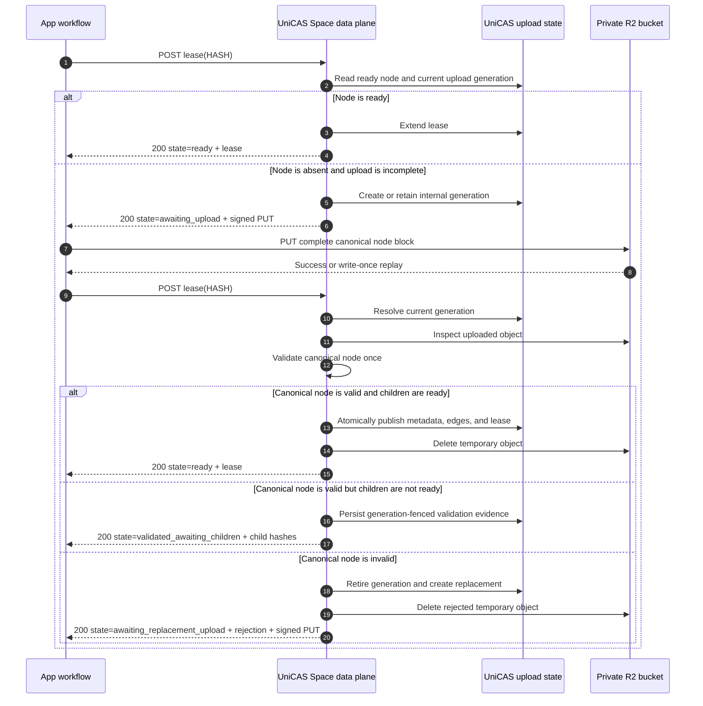
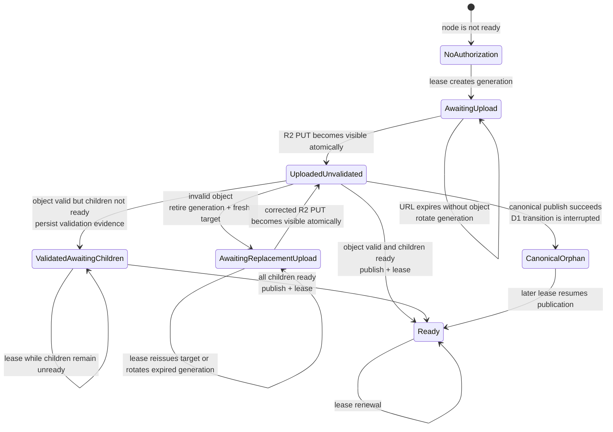

# Lease-driven direct node upload

Status: implemented; pending delivery acceptance

Updated: 2026-09-20

## Decision summary

The public v2 API has one node lease operation. A client always asks to lease a
hash and optimistically assumes that the node already exists. UniCAS returns a
ready lease when it does. When it does not, UniCAS returns short-lived direct
upload instructions.

After uploading, the client repeats the exact same lease request. UniCAS
observes its internal upload state and object storage, validates the canonical
node once, then returns a ready lease, all unready child hashes, or replacement
upload instructions after rejecting the uploaded bytes.

The public request contains no canonical length, upload ID, canonical bytes,
or upload-mode selector. Backward compatibility with the existing inline and
header-selected upload modes is intentionally not preserved.

## API

```http
POST /v2/apps/{appId}/spaces/{spaceId}/cas/nodes/{hash}/lease
Authorization: Bearer <capability>
Content-Type: application/json

{"leaseDurationMs":900000}
```

The request has one JSON property, `leaseDurationMs`. It is required on the
wire and clamped to the supported lease interval. The public client supplies
the documented default when its caller omits the whole options argument, so
the request type does not need an optional property. Lease duration is an
operation input rather than HTTP metadata and is therefore not encoded in a
custom header.

The caller needs only the node hash. It does not need to fetch metadata, know
the canonical object's length, or declare whether it can upload the node.

After path and body parsing, the service receives a fully normalized request:

```ts
interface LeaseNodeRequest {
  readonly appId: string;
  readonly spaceId: string;
  readonly hash: string;
  readonly leaseDurationMs: number;
}
```

`leaseDurationMs` is always present here. The client-level default is applied
before serialization rather than represented as transport absence.

## Results

### Ready

```http
HTTP/1.1 200 OK
Content-Type: application/json
Cache-Control: no-store
```

```json
{
  "state": "ready",
  "hash": "0123456789abcdef0123456789abcdef0123456789abcdef0123456789abcdef",
  "leaseStartedAt": 1760000000000,
  "leaseExpiresAt": 1760000900000
}
```

This result means the node is validated, readable, referenceable by later
nodes, and protected from collection until the returned deadline.

### Awaiting upload

```http
HTTP/1.1 200 OK
Content-Type: application/json
Cache-Control: no-store
```

```json
{
  "state": "awaiting_upload",
  "hash": "0123456789abcdef0123456789abcdef0123456789abcdef0123456789abcdef",
  "upload": {
    "method": "PUT",
    "url": "https://presigned-upload-target.example/...",
    "expiresAt": 1760000300000,
    "headers": {
      "Content-Type": "application/vnd.unidocs.cas-node.v1",
      "If-None-Match": "*"
    }
  }
}
```

`awaiting_upload` is a successful lease negotiation result that requires
caller action, not an asynchronously executing server job. It therefore uses
HTTP 200 rather than 202.

The response contains no upload ID, temporary object key, storage credential,
or App capability.

### Awaiting replacement upload

When the prior object failed immutable validation, lease returns a distinct
state with an explicit, publish-safe rejection and a fresh upload target:

```json
{
  "state": "awaiting_replacement_upload",
  "hash": "0123456789abcdef0123456789abcdef0123456789abcdef0123456789abcdef",
  "rejection": {
    "code": "NODE_DIGEST_MISMATCH",
    "message": "Uploaded canonical bytes did not match the requested node hash"
  },
  "upload": {
    "method": "PUT",
    "url": "https://replacement-upload-target.example/...",
    "expiresAt": 1760000600000,
    "headers": {
      "Content-Type": "application/vnd.unidocs.cas-node.v1",
      "If-None-Match": "*"
    }
  }
}
```

The replacement target uses a new internal generation and a new temporary
object key. The caller can therefore correct and upload the bytes immediately;
it is never asked to overwrite the rejected write-once object.

The replacement generation durably retains the publish-safe rejection that
caused it. Repeating lease before a corrected PUT therefore remains
`awaiting_replacement_upload` and returns that rejection with upload
instructions for the current replacement generation. Expiry may rotate its
URL and internal key, but does not erase the rejection context. This keeps the
response stable across retries without exposing generation identity.
`rejection.code` classifies why the bytes were rejected; it is not another
lifecycle-state discriminator.

### Validated, waiting for children

Canonical bytes can be valid while one of their referenced children is not yet
ready. This is not an upload rejection and does not require the parent to be
uploaded again:

```json
{
  "state": "validated_awaiting_children",
  "hash": "0123456789abcdef0123456789abcdef0123456789abcdef0123456789abcdef",
  "childHashes": [
    "abcdef0123456789abcdef0123456789abcdef0123456789abcdef0123456789",
    "fedcba9876543210fedcba9876543210fedcba9876543210fedcba9876543210"
  ]
}
```

UniCAS retains the uploaded and structurally validated parent object. After the
children become ready, the caller repeats the same lease request and
publication continues without another parent PUT.

`childHashes` contains every distinct child that is not ready when the lease is
evaluated, in first-occurrence order from the canonical refs. The canonical
format permits at most 256 refs, so the complete dependency response is
bounded. Returning all dependencies lets the caller make them ready in one
round rather than discovering one child per repeated parent lease.

### Response and state correspondence

Every successful response names the derived state that remains after the
lease operation has evaluated and advanced the state machine. Wire values use
snake case while the state diagram uses matching PascalCase labels.

| State observed when lease begins | Lease action | Successful response state |
| --- | --- | --- |
| `NoAuthorization` | Create an upload generation and authorize its temporary object. | `awaiting_upload` |
| `AwaitingUpload` | Retain a live generation, or rotate an expired generation that has no object. | `awaiting_upload` |
| `AwaitingReplacementUpload` | Retain or rotate the replacement generation and preserve its rejection context. | `awaiting_replacement_upload` |
| `UploadedUnvalidated` | Validate the object, then publish it, retain it for children, or replace a rejected generation. | `ready`, `validated_awaiting_children`, or `awaiting_replacement_upload` |
| `ValidatedAwaitingChildren` | Recheck child readiness without rehashing or reparsing. | `validated_awaiting_children` or `ready` |
| `CanonicalOrphan` | Resume the interrupted publication. | `ready` |
| `Ready` | Confirm canonical storage and extend the lease. | `ready` |

`NoAuthorization`, `UploadedUnvalidated`, and `CanonicalOrphan` are internal
pre-evaluation states. UniCAS must not return them because the active lease
operation can advance them immediately. A ready D1 record without its
canonical object is a storage-integrity fault rather than a successful state;
it returns the standard HTTP 500 `INTERNAL_ERROR` response and emits an
operational alert.

## Sequence



The first and post-upload lease requests are byte-for-byte equivalent apart
from ordinary authentication-token rotation.

## Signal model

`lease` is the only active signal that evaluates and advances the node
state machine.

Two hidden signals can change the facts that the next lease observes:

- direct `PUT` makes a temporary R2 object atomically visible; and
- passage of time expires a presigned authorization or internal generation.

Neither hidden signal publishes a node. R2 does not call back into UniCAS when
PUT completes, and expiration does not execute a business transition by
itself. A later lease request observes the changed facts and performs the
necessary validation, generation rotation, publication, or renewal.

Background cleanup may physically delete expired or superseded artifacts, but
it must not make a node ready. Root Ref updates, reads, metadata requests, and
garbage collection likewise do not advance the upload state machine.

For a parent waiting on a child, the child's own upload and lease can make that
child ready, but the parent advances only when its lease operation is invoked
again.

```text
hidden fact changes:
    PUT  -> temporary object becomes present
    time -> authorization becomes expired

only active transition command:
    lease -> observe facts, apply side effects, return current outcome
```

## Derived state model

UniCAS does not persist a separate upload-state enum. It persists only the
facts needed to recover the operation:

- the node record and its `ready` flag;
- immutable metadata and ordered refs already derived from a successfully
  validated object;
- the current upload-authorization record, including its internal generation,
  temporary key, and expiry; and
- the temporary and canonical R2 objects.

The effective state is derived from those facts on every lease request.

### Complete state table

| Ready | Current upload record | Current temporary object | Durable validation evidence | Derived condition | Lease behavior |
| --- | --- | --- | --- | --- | --- |
| `true` | Irrelevant | Irrelevant | Present | Ready | Confirm canonical object presence, extend lease, return `state: "ready"`. |
| `false` or absent | Absent or expired | Absent | Absent | No usable upload authorization | Create a generation and return `state: "awaiting_upload"` with upload instructions. |
| `false` or absent | Valid | Absent | Absent | Upload authorized but incomplete | Return upload instructions for the current generation. |
| `false` or absent | Valid with prior rejection | Absent | Absent | Replacement upload authorized but incomplete | Return `state: "awaiting_replacement_upload"` with the retained rejection and upload instructions. |
| `false` or absent | Valid or expired | Present | Absent | Uploaded and not yet validated | Perform immutable validation once. |
| `false` | Present | Present | Present | Structurally valid, waiting for children | Recheck only child readiness; do not rehash, reparse, or re-upload. |
| `false` or absent | Present | Present | Rejected by this lease | Invalid uploaded object | Retire the generation, create a replacement, and return the rejection with a fresh upload target. |
| `false` or absent | Any recoverable record | Canonical object present | Present or reconstructible | Publication interrupted | Resume or adopt the canonical object and complete the ready transition. |
| `true` | Irrelevant | Canonical object absent | Present | Storage inconsistency | Return a storage-integrity failure and alert; never downgrade to upload required. |

“Uploaded but rejected” is an observed transition. The detecting lease call
atomically retires that generation and creates its replacement before
returning. The resulting `AwaitingReplacementUpload` state is derived from the
current replacement authorization carrying the publish-safe rejection; it is
not a separately persisted state enum.

“Validated but waiting for children” does require durable validation evidence
if full validation is to occur only once. This evidence need not be a state
enum. It can be represented by the presence of staged immutable metadata and
ordered refs associated with the current generation. A later lease rechecks
only the mutable child-readiness condition.

An expired signing URL prevents additional writes; it does not invalidate an
object already written through that generation. If the current temporary
object exists, UniCAS still validates and may publish it after the URL expires.

### State transitions



R2 object creation is atomically visible, so the state machine does not model a
partially readable object. While a PUT is in progress, the current temporary
object is absent and lease returns the current upload instructions.

`CanonicalOrphan` represents failure after immutable canonical publication but
before the D1 ready transition. It is a recovery condition, not a normal client
state. A ready record whose canonical object is missing is an integrity fault
and must not transition back to an upload state.

### Concrete predicates for diagram states

The state names in the diagram are shorthand for the following storage
conditions. `upload record valid` means that the current D1 upload-
authorization row is generation-current and its signing deadline is later than
the lease evaluation time.

| Diagram state | D1 node record | D1 upload-authorization record | R2 objects | Additional condition |
| --- | --- | --- | --- | --- |
| `NoAuthorization` | Absent, or `ready = false` without validation evidence | Absent, superseded, or expired | No current temporary object and no canonical object | There is no completed upload to validate. The next lease creates a generation and signed target. |
| `AwaitingUpload` | Absent, or `ready = false` without validation evidence | Present, current, and valid | Current temporary object absent; canonical object absent | A PUT may not have started or may still be in progress. R2 does not expose a partial object. |
| `AwaitingReplacementUpload` | Absent, or `ready = false` without validation evidence | Present, current, and carrying a prior rejection | Current temporary object absent; canonical object absent | A prior upload failed immutable validation. The replacement target awaits corrected bytes. |
| `UploadedUnvalidated` | Absent, or `ready = false` without validation evidence | Present and current; it may now be valid or expired | Current temporary object present; canonical object absent | Immutable size, digest, envelope, metadata, and refs have not yet been durably accepted. |
| `ValidatedAwaitingChildren` | Present with `ready = false` | Present and tied to the same current generation | Validated temporary object present, or an equivalent recoverable canonical object | Generation-fenced immutable metadata and ordered refs are durable, and at least one referenced child is not ready. |
| `CanonicalOrphan` | Absent, or present with `ready = false` and an incomplete publication transition | May be present, expired, or already cleared | Canonical hash-addressed object present | Immutable publication reached R2, but the D1 ready transition did not commit. |
| `Ready` | Present with `ready = true`; immutable metadata and ordered edges committed | Irrelevant and eligible for cleanup | Canonical hash-addressed object present | Child readiness and child-count updates were committed before or with `ready = true`. |

Two exceptional observations are transitions or faults rather than stable
diagram states:

- **Rejected uploaded object:** D1 is not ready, the current temporary object
  exists, and immutable validation fails. The same lease retires that
  generation, creates a new upload record and temporary key, and returns the
  rejection with replacement upload instructions.
- **Storage inconsistency:** D1 says `ready = true`, but the canonical R2 object
  is absent. Lease returns a storage-integrity error and alerts; it does not
  create an upload authorization.

When facts overlap, lease evaluates them in this order:

1. ready-record/canonical-object consistency;
2. recoverable canonical orphan;
3. durable validation evidence waiting on children;
4. current temporary object awaiting immutable validation;
5. valid upload authorization awaiting PUT; and
6. absence of usable authorization.

This precedence prevents an expired URL from hiding an already uploaded object
and prevents a stale upload record from overriding a ready or recoverable
canonical node.

## Canonical object

The direct PUT contains the complete canonical CAS node block:

```text
canonical node bytes =
    canonical header
  + UTF-8 content type
  + ordered child hashes
  + opaque content
```

The node identity is:

```text
hash = SHA-256(canonical node bytes)
```

It is not the hash of the opaque content alone.

For a non-leaf node, ordered child refs are therefore encoded in the R2 object
and covered by its hash. When the node becomes ready, UniCAS projects those
refs into D1 `cas_edges` rows and updates child reference counts.

R2 canonical bytes are the immutable source of truth. D1 metadata, edges, and
reference counts are rebuildable serving and garbage-collection projections.

## Server-owned state

UniCAS identifies the current upload by `(appId, spaceId, hash)` and may store:

```ts
interface InternalNodeUpload {
  readonly appId: string;
  readonly spaceId: string;
  readonly hash: string;
  readonly generation: string;
  readonly temporaryObjectKey: string;
  readonly createdAt: number;
  readonly expiresAt: number;
  readonly cleanupAt: number;
  readonly rejection: {
    readonly code: string;
    readonly message: string;
  } | null;
  readonly validation: {
    readonly storedBytes: number;
    readonly contentSize: number;
    readonly contentType: string;
    readonly refs: readonly string[];
  } | null;
}
```

`generation` and `temporaryObjectKey` are internal fencing details. A unique
temporary key binds each signed URL to one generation. UniCAS only inspects the
temporary key of the current generation, so a late write through an obsolete
URL cannot publish into a newer generation.

The state does not store a client-provided length or lease duration. The lease
duration from the request that actually observes or publishes the ready node
controls the resulting lease.

If structural validation succeeds before all children are ready, UniCAS must
durably associate the parsed content size, content type, ordered refs, and
validation identity with the current generation. Their presence is evidence
that immutable validation completed; it avoids adding a workflow-state enum
and prevents repeated hashing or parsing on later lease calls.

## Lease algorithm

For each request, UniCAS performs:

```text
if a ready D1 node exists:
    verify its canonical object is present using the normal ready fast path
    extend the lease
    return state=ready

session = current internal upload state for (App, Space, hash)

if session does not exist:
    create a new internal generation and temporary key

object = inspect the current temporary key

if object is absent:
    if the session or signed URL expired:
        rotate to a new generation and temporary key
  if the current generation carries a prior rejection:
    return state=awaiting_replacement_upload with rejection and upload instructions
  return state=awaiting_upload with upload instructions

if object is present:
    accept it for validation even if its signed URL has since expired
    if durable validation evidence already exists:
        recheck only child readiness
        publish when every child is ready
    validate its size, digest, and canonical structure
    if those immutable checks fail:
        retire the current generation
        create a replacement generation and temporary key carrying the rejection
        return state=awaiting_replacement_upload with rejection and the new target
    if any child is not ready:
        retain the validated object and return state=validated_awaiting_children with all unready child hashes
    publish it exactly once
    establish the requested lease
    return state=ready

if a canonical object exists without a completed ready record:
    resume or adopt the interrupted publication

if a ready record exists without its canonical object:
    return a storage-integrity error and emit an operational alert
```

An in-instance single-flight keyed by `(appId, spaceId, hash)` joins concurrent
publication attempts. The implementation serializes the complete evaluation
under the Space mutation gate; direct PUT remains outside that gate. Durable
generation fencing and write-once object keys cover retries and process
restarts. A future implementation may move R2 reads outside the mutation gate
only if it rechecks the same generation before staging or publication.

## Validation boundary

The direct PUT stores an untrusted temporary object. It does not make the node
ready, readable, or referenceable.

The first lease request that observes a complete upload performs:

- the 32 MiB canonical-object size check;
- SHA-256 equality with the path hash;
- canonical binary envelope validation;
- content-size and content-type extraction;
- ordered child-ref extraction and limits;
- existing immutable metadata consistency, if applicable;
- child readiness checks; and
- atomic D1 node, edge, child-count, reservation, and lease updates.

After this transition, the node is ready. Later lease and positive Root Ref
operations do not parse or hash the canonical bytes again.

The upload record remains until temporary-object deletion succeeds. Only then
is it removed. If deletion fails after the ready commit, its `cleanupAt`
deadline keeps the object discoverable by bounded GC without weakening ready
state.

The validation scope is `(appId, spaceId, hash)`. This design does not introduce
global cross-Space validation or deduplication.

An immutable validation failure must not strand the caller behind the
write-once temporary key. In the same serialized lease operation, UniCAS
retires the rejected generation, creates a new generation and key carrying the
publish-safe rejection, schedules the rejected object for deletion, and
returns `state: "awaiting_replacement_upload"` with the rejection and
replacement instructions. The replacement is durable before the response is
returned, so retrying the lease cannot rediscover the rejected generation as
current or lose its rejection context.

Child readiness is different from an invalid upload. The canonical bytes may
be valid while a referenced child is still being published. UniCAS retains the
validated temporary object and returns
`state: "validated_awaiting_children"` with all unready child hashes. After all
listed children become ready, repeating the same parent lease request resumes
publication without uploading the parent again.

The durable validation evidence is fenced by the internal generation. If that
generation is retired, its staged metadata and refs are deleted with it and
cannot be applied to a replacement object's bytes.

## Root Ref boundary

A positive Root Ref update accepts only ready nodes. It checks ready state and
reference-count constraints but does not recursively inspect the DAG.

This preserves bounded Root Ref transactions. Parent publication has already
validated children and projected edges, so child reference counts protect the
uploaded DAG before its final root becomes committed business state.

## Presigned upload constraints

The target must be:

- short-lived;
- scoped to one internal temporary object key;
- write-once;
- restricted to the canonical node media type;
- independent of the App capability; and
- free of reusable object-storage credentials.

The public request does not declare an exact content length. The 32 MiB limit
is therefore guaranteed at publication, not before bytes reach R2. Cloudflare's
R2 S3 compatibility documentation (reviewed 2026-09-20) supports `Content-MD5`
for PutObject but not a SHA-256 `FULL_OBJECT` checksum. Because the CAS path
hash is SHA-256 and does not determine an MD5 value, the presigned PUT cannot
bind the canonical digest without adding another client-provided checksum.
UniCAS therefore signs the object key, method, canonical media type, expiry,
and `If-None-Match`, then computes SHA-256 itself on the next lease.

The accepted residual exposure is:

- a holder of a short-lived URL may transfer an oversized temporary object;
- the object never becomes ready and is deleted when observed or expired;
- per-Space active-upload limits, short expiry, and cleanup bound temporary
  storage and request abuse.

The implementation must not describe the 32 MiB publication check as an
upload-time object-store limit unless the provider enforces it.

## Retry and recovery

| Situation | Lease result or action |
| --- | --- |
| Ready node | Extend lease and return `state: "ready"`. |
| Missing temporary object | Return `state: "awaiting_upload"` with a newly signed URL for the current generation. |
| Successful PUT followed by process failure | Repeating lease observes the object and returns `state: "ready"` after publication, or another state dictated by validation. |
| Repeated PUT to the same generation | Object store returns its write-once result; caller repeats lease. |
| Concurrent lease after upload | One request publishes; others join or return `state: "ready"`. |
| Expired generation without an object | Rotate generation and return `state: "awaiting_upload"` with a new URL. |
| Expired signing URL with an object | Validate the completed object and return the resulting state; URL expiry only prevents another PUT. |
| Oversized or malformed object | Retire the generation and return `state: "awaiting_replacement_upload"` with rejection details and a new write-once target. |
| Digest mismatch | Retire the generation and return `state: "awaiting_replacement_upload"` with rejection details and a new write-once target. |
| Repeated lease before corrected PUT | Return `state: "awaiting_replacement_upload"` with the retained rejection and current replacement target. |
| One or more children not ready | Retain the validated object and return `state: "validated_awaiting_children"` with every distinct unready child hash; repeating lease resumes publication without re-upload. |
| Failure after canonical R2 publication but before D1 commit | A later lease adopts the verified canonical orphan and returns `state: "ready"`. |
| Failure after D1 ready commit | A later lease returns `state: "ready"`; temporary cleanup is retried asynchronously. |
| Ready record without canonical content | Return a storage-integrity error and alert; never present the node as uploadable. |

The client can recover from every interruption using only the node hash and,
when upload is required, a replayable source of the canonical bytes.

## Cancellation and cleanup

There is no public cancel operation. The upload state is shared by every caller
leasing the same hash, so one caller must not cancel another caller's useful
upload.

Abandonment means the client stops. UniCAS expires and cleans:

- internal upload state;
- upload reservation;
- temporary object;
- obsolete generation objects; and
- any canonical orphan that cannot be adopted.

Before replacing a generation, UniCAS records its temporary key in a durable
cleanup queue. The key leaves that queue only after deletion succeeds, so an
R2 failure cannot make a superseded object unreachable to later cleanup.

Cleanup must run without requiring a later request for the same hash.
Presigned URL expiry must not exceed the corresponding internal generation
lifetime. If an old URL can remain valid during cleanup, its key must remain
tracked until the URL can no longer recreate the object, or a bucket lifecycle
rule must independently guarantee its eventual deletion.

## Client contract

Request types contain no optional properties. The convenience method may omit
the whole options object, in which case it uses the complete default value.
Supplying an options object requires every property, including `signal: null`
when cancellation is not needed.

```ts
const DEFAULT_LEASE_DURATION_MS = 900_000;

interface LeaseNodeOptions {
  readonly durationMs: number;
  readonly signal: AbortSignal | null;
}

const DEFAULT_LEASE_NODE_OPTIONS: LeaseNodeOptions = {
  durationMs: DEFAULT_LEASE_DURATION_MS,
  signal: null,
};

type LeaseNodeResult =
  | {
  readonly state: "ready";
      readonly hash: string;
      readonly leaseStartedAt: number;
      readonly leaseExpiresAt: number;
    }
  | {
      readonly state: "awaiting_upload";
      readonly hash: string;
      readonly upload: {
        readonly method: "PUT";
        readonly url: string;
        readonly expiresAt: number;
        readonly headers: Readonly<Record<string, string>>;
      };
    }
  | {
      readonly state: "awaiting_replacement_upload";
      readonly hash: string;
      readonly rejection: {
        readonly code:
          | "NODE_TOO_LARGE"
          | "NODE_DIGEST_MISMATCH"
          | "INVALID_CANONICAL_NODE"
          | "NODE_CONFLICT";
        readonly message: string;
      };
      readonly upload: {
        readonly method: "PUT";
        readonly url: string;
        readonly expiresAt: number;
        readonly headers: Readonly<Record<string, string>>;
      };
    }
  | {
      readonly state: "validated_awaiting_children";
      readonly hash: string;
      readonly childHashes: readonly string[];
    };

interface LeaseNodeClient {
  leaseNode(hash: string): Promise<LeaseNodeResult>;
  leaseNode(hash: string, options: LeaseNodeOptions): Promise<LeaseNodeResult>;
}
```

The zero-options overload applies `DEFAULT_LEASE_NODE_OPTIONS`; the second
overload requires a complete options value. Neither overload introduces an
optional request property.

Every response variant has only required properties. `state` is the sole
lifecycle discriminator: data that is not valid for every state lives only in
the corresponding union member rather than behind an optional property.

The transport client does not accept a node body and does not automatically
perform the direct PUT. A higher-level node/blob client may provide the
convenience loop:

```text
lease(hash)
if state is awaiting_upload:
    obtain or construct canonical bytes
    PUT using returned instructions
    lease(hash)
if state is awaiting_replacement_upload:
    surface the rejection to the caller
    obtain corrected canonical bytes
    PUT using returned instructions
    lease(hash)
if state is validated_awaiting_children:
    make every listed child ready
    lease(hash)
require state is ready
```

Keeping the direct PUT outside the transport client's lease operation makes
the state transition explicit, permits caller-controlled retry and progress,
and avoids hiding a non-replayable body inside an apparently simple lease
call.

## Removed compatibility surface

The redesign removes:

- `X-CAS-Lease-Duration`;
- `X-CAS-Upload-Length`;
- `X-CAS-Upload-Id`;
- canonical byte bodies on the lease route;
- inline upload through the UniCAS Worker;
- the `uploadMode: "legacy" | "direct"` client option;
- a `CasNodeSource` parameter on the low-level `leaseNode` call; and
- protocol descriptions that combine body upload with lease renewal.

There is one v2 behavior after rollout. Deployment must configure direct R2
upload signing and cleanup before the incompatible API is enabled.
