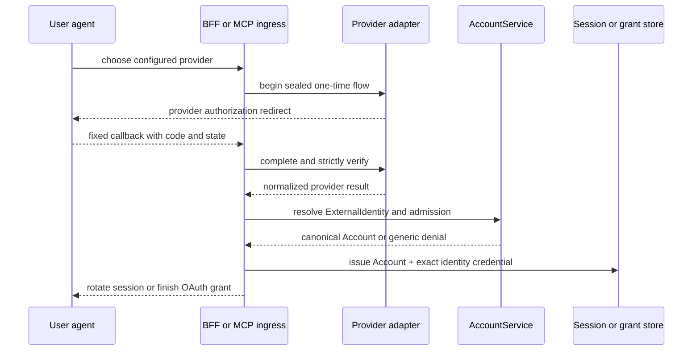

# Architecture review

Status: Pending approval

## Decision requested

Approve the module responsibilities, provider adapter contract, account-binding
and session flow, linking/unlinking state machines, email delivery boundary,
revocation behavior, deployment sequence, and compatibility boundaries below.
Approval permits structural implementation after the business/data-model and
interface checkpoints are also approved.

## Existing boundaries

UniCAS remains one deployment with separate administrator and data access
planes:

```text
admin-webui / admin-cli / stdio MCP
        -> admin-client -> admin-protocol
        -> service-cloudflare ingress and adapters
        -> service cloud-neutral policy and ports

data-plane clients -> tenant routes and capability verification
```

The current implementation has reusable OIDC primitives in
`/packages/control-auth/src/index.ts`, but the administrator BFF and remote MCP
authorization each compose one Google client directly. Encrypted sessions carry
only `(identityIssuer, subject)` and display fields. The change must not make an
administrator session a Space/data-plane credential.

## Responsibility split

### `@unicas/admin-protocol`

Owns administrator wire types, account summaries, identity-management routes,
error codes, schemas, OpenAPI, and pure validation helpers. It has no provider
IO, tokens, email transport, storage, or application workflow.

### `@unicas/admin-client`

Adds one thin `Request -> Promise<Response>` operation per new administrator
endpoint. It keeps session cookie and CSRF handling but contains no provider
SDK, endpoint selection, linking policy, or challenge workflow.

### `@unicas/control-auth`

Remains a cloud-neutral authentication protocol library. It owns:

- OIDC discovery retrieval and cache policy;
- authorization-code exchange with PKCE S256;
- state and nonce generation/verification helpers;
- strict JWT signature, algorithm, issuer, audience, time, nonce, and subject
  validation;
- generic OAuth authorization-code/PKCE helpers used by GitHub.

It does not know UniCAS Accounts, invitations, memberships, profile precedence,
linking policy, Cloudflare bindings, or UI routes. It accepts provider-pinned
configuration from server composition; callback input never selects discovery,
token, JWKS, API endpoints, or algorithms.

### `@unicas/service`

Owns every durable security and business invariant behind explicit ports:

- canonical Account resolution and blocked-state checks;
- external identity binding and conflict detection;
- profile precedence and primary verified-contact persistence policy;
- fresh VerifiedEmailEvidence validation;
- invitation acceptance and atomic evidence consumption;
- linking/unlinking preconditions and credential-version checks;
- session/grant `credentialVersion` changes and revocation intent;
- command-shaped platform-authority grants/revokes, memberships, Playground
  ownership, and audit;
- future AccountAlias canonicalization with cycle/depth failure.

Suggested cloud-neutral services and ports are cohesive additions to the current
control-plane actor, not new deployment units:

```text
AccountService
AccountRepository
ExternalIdentityRepository
AccountAuthorityRepository
EmailChallengeRepository
IdentityLinkIntentRepository
AccountSessionRevocationPort
AuthenticationAuditPort
```

Provider adapters hand `AccountService` a normalized authenticated result; they
cannot attach an identity, grant admission, or accept an invitation themselves.

### `@unicas/service-cloudflare`

Owns platform and provider IO:

- server-side provider registry and environment configuration;
- Google and Microsoft OIDC adapter composition;
- GitHub OAuth token exchange plus `/user` and `/user/emails` calls;
- D1 implementations of the service ports and atomic transactions;
- encrypted BFF session and one-time continuation persistence;
- Cloudflare Email Service `send_email` binding for challenge delivery;
- browser BFF, CLI authorization, and remote MCP OAuth presentation;
- provider/network error normalization, structured redacted logs, and metrics.

Provider secrets, session keys, challenge material, and access tokens remain in
this package and Worker bindings only. Email uses the Worker binding rather than
the Cloudflare REST API, so no Cloudflare API token is introduced at runtime.

### `@unicas/admin-webui` and `@unicas/admin-cli`

The WebUI renders provider choices and Account management from protocol data.
It never receives provider client secrets, access tokens, private email lists,
or challenge hashes. The CLI continues to open the BFF and exchange a one-time
PKCE-bound code; it does not implement Google, Microsoft, or GitHub directly.
Stdio MCP continues to use the stored administrator session.

## Provider registry

The Worker builds an immutable registry per request from validated environment
configuration. Registry entries are server selected by a closed `ProviderKind`
enum, never arbitrary callback URLs.

```text
ProviderAdapter
  kind
  displayMetadata
  begin(flowContext) -> authorization redirect + sealed continuation
  complete(callback, continuation) -> AuthenticatedProviderResult

AuthenticatedProviderResult
  provider
  issuer
  subject
  displayName?
  avatarUrl?
  verifiedEmailEvidence[]
  authenticatedAt
```

The sealed continuation binds provider, purpose (`login`, `link-current`,
`link-target`, `unlink`, `cli`, or `mcp`), redirect URI, PKCE verifier hash,
state, nonce when applicable, current Account when applicable, invitation hash,
creation/expiry, and one-time identifier. It expires after 10 minutes and is
consumed once. Callback routes recover this record by an opaque state handle;
they do not trust provider or endpoint query parameters.

### Google adapter

- Authorization code with PKCE S256, state, and nonce.
- Pinned Google discovery/issuer and registered redirect URI.
- Allow only configured signing algorithms and validate signature, issuer,
  audience, expiry/not-before, nonce, and nonempty `sub`.
- Request only `openid profile email`.
- Emit email evidence only when `email_verified === true`.
- Use `sub` as subject; email, name, and picture are attributes only.
- Do not request offline access or retain tokens.

### Microsoft personal-account adapter

- Pinned `https://login.microsoftonline.com/consumers/v2.0` authority and
  discovery; the application registration must support personal accounts.
- Authorization code with PKCE S256, state, nonce, and exact redirect URI.
- Validate signature, configured client audience, time claims, nonce, exact
  token issuer for the consumers tenant, nonempty pairwise `sub`, v2 token, and
  personal-account tenant `9188040d-6c67-4c5b-b112-36a304b66dad`.
- Request only `openid profile email`; do not request Graph permissions.
- Treat `email` and `preferred_username` only as display/challenge prefill hints.
  They never produce VerifiedEmailEvidence.
- Keep tenant-template validation for a future `common` provider out of this
  registry and task.

### GitHub adapter

- Pinned `github.com` authorization/token endpoints and `api.github.com` API.
- Authorization code with state and PKCE S256; exact configured callback URI.
- Request only `read:user user:email`; do not request repositories or
  `offline_access`.
- After every token exchange, call authenticated `GET /user` and use the durable
  numeric `id` converted to a decimal string as subject. Never use login name.
- Call `GET /user/emails` with `Accept: application/vnd.github+json` and the
  configured current API-version header. Only `verified=true` entries can
  produce evidence; public profile email alone cannot.
- Keep the access token in callback-local memory only and discard it after both
  API calls. Do not persist refresh tokens.

Any provider verification or API ambiguity fails closed with the same public
error class. Detailed upstream status is redacted into structured operator
telemetry without token, code, email-list, or Account data.

## Login and account binding

All browser, CLI, and MCP paths share this sequence:



For an unbound identity, Account creation does not imply admission. The service
creates one Account and link only when a valid invitation continuation or an
existing bootstrap/admission policy authorizes the transaction. Otherwise it
may retain no Account at all and returns a generic denial. Matching email never
selects an existing Account.

Every authenticated request resolves any AccountAlias, requires `blockedAt` to
be null, compares the credential's `credentialVersion` with the Account, and
evaluates current admission before the operation. The exact ExternalIdentity
remains available to audit.

## Linking state machine

Linking proves both sides freshly and does not reuse an old session assertion:

1. An authenticated Account starts a link intent with CSRF/origin protection,
  target provider, Account `credentialVersion`, and 10-minute expiry.
2. Reauthenticate an identity already linked to the current Account. Provider
   completion must resolve to that same canonical Account; otherwise fail.
3. Rotate to a one-time intent that contains only opaque handles, then
   authenticate the target provider with a new state, PKCE verifier, and nonce
   where supported.
4. In one D1 transaction, canonicalize the current Account, require an unchanged
  `credentialVersion`, reject an active target binding to any other Account,
  attach an unowned identity, apply profile/primary-contact rules, write audit,
  increment `credentialVersion`, consume the intent, and schedule credential
  revocation.
5. Revoke prior browser/CLI sessions and remote MCP grants, then issue one new
   session from the fresh current-account proof. Failure before commit changes
   nothing; failure after commit cannot return a usable stale credential.

An identity already bound to the same Account is an idempotent success. An
identity bound elsewhere returns a generic conflict requiring a future Merge;
no other Account identifier, email, grants, or existence details are exposed.

## Unlinking state machine

1. Start from an authenticated Account with CSRF/origin protection and current
  Account `credentialVersion`.
2. Freshly authenticate an identity that will remain linked after the operation.
   To unlink the currently used identity, the user must first authenticate a
   different linked identity.
3. In one transaction, require at least two usable active identities, an
  unchanged `credentialVersion`, and ownership of the target link; set
  `unlinkedAt`, update profile sources, write audit, increment
  `credentialVersion`, and consume the intent.
4. Revoke all prior sessions and grants and issue one replacement session for
   the remaining freshly authenticated identity.

There is no endpoint that removes the final usable identity.

## Email challenge flow

The service creates a challenge only for an authenticated Microsoft personal
identity carrying an email-constrained invitation continuation. The caller
cannot choose a different destination.

1. `AccountService` normalizes the invitation's stored address and creates an
   opaque challenge ID, cryptographically random code, hash, expiry, attempt
   budget, provider authentication event, and invitation hash.
2. The Cloudflare adapter sends a transactional message through the `EMAIL`
   binding from an onboarded UniCAS domain, with text and HTML bodies. The
   response remains generic whether delivery is queued or rejected.
3. Verification hashes the submitted code, compares fixed-size values, applies
   rate/attempt limits, and records a one-time evidence handle. Raw codes are
   never logged or persisted.
4. Invitation acceptance atomically consumes the evidence and invitation and
   grants the canonical Account. A send or verification failure grants nothing.

Sending is awaited when challenge creation depends on successful provider
acceptance. Retryable asynchronous delivery may later use a Queue, but at-least-
once delivery never changes single-use verification semantics.

## Sessions, CLI, and MCP grants

Browser and CLI sessions remain opaque encrypted payloads in D1. Additive fields
carry `accountId`, `externalIdentityId`, provider, exact issuer/subject,
`authenticatedAt`, and `credentialVersion`; legacy identity fields remain
through the compatibility window. The session table indexes `account_id` for revocation.
Legacy sessions may resolve and rotate on a read request but cannot mutate until
rotation succeeds. Unknown or ambiguous mappings are revoked. Each credential
migration is counted in the idempotent migration journal before Account reads
become authoritative.

CLI one-time codes bind the Account result, exact identity, CLI state, redirect
URI, and PKCE challenge. Exchange consumes the code and issues the same Account
session type used by the browser.

Remote MCP OAuth authorization uses the shared provider registry and account
binding before grant issuance. Grants store original `accountId`, exact login
identity, and `credentialVersion`. Token validation canonicalizes the Account
and checks current credential version and admission on every request. Existing grants are migrated
server-side through the permanent legacy map while preserving their old fields;
unmapped grants are revoked. Stdio MCP remains an
admin-client presentation over the CLI session. Neither path receives a tenant
capability merely by authenticating.

## Revocation

The accepted revocation bound applies at Account resolution:

- blocking an Account sets `blockedAt`, increments `credentialVersion`, and deletes indexed BFF/CLI
  sessions and remote MCP grants;
- removing the final platform authority or App membership makes admission fail
  for every identity even if a credential remains cryptographically valid;
- link/unlink increments `credentialVersion` and rotates affected credentials;
- provider revocation alone does not silently move grants, but a failed fresh
  provider authentication cannot create a new UniCAS credential;
- alias resolution in a future Merge revokes source credentials before survivor
  issuance.

Deletion is defense in depth; credential-version and current-admission checks
are the fail-closed control within the revocation bound.

## Deployment and migration sequence

1. Publish approved model, architecture, and interface artifacts.
2. Add protocol types and service ports without changing active behavior.
3. Add D1 schema, idempotent one-to-one backfill, reconciliation, and legacy
   session resolution under `legacy`/`shadow` stages.
4. Deploy shadow reads with Google only; compare Account and legacy projections,
   ownership, and authorization in tests and production-safe telemetry.
5. Switch to `account-google`, rotate sessions on use, and verify browser, CLI,
   MCP, invitation, revocation, and Playground behavior.
6. Add the provider registry while retaining Google as default and keeping
   legacy Google routes as compatibility redirects.
7. Configure Microsoft and GitHub secrets/endpoints plus the Email binding in
   non-production; validate all fail-closed provider and challenge flows.
8. Enable `multi-provider` login, then linking/unlinking, only after migration
   reconciliation and rollback rehearsal pass. Record this as the point after
   which identity-keyed binary rollback is forbidden.
9. Deploy to production through normal dry-run/release gates. Keep legacy tables
   and columns until a later cleanup task after the compatibility period.

At each stage, provider availability is configuration-driven. One misconfigured
provider is unavailable without weakening another; if no provider is valid,
login fails closed while authenticated session checks continue.

## Compatibility boundaries

- Existing `/admin/me`, Google login, CLI loopback, and MCP OAuth entry points
  remain during transition; new fields are additive until clients migrate.
- Old sessions are accepted only long enough to resolve and rotate through the
  permanent migration map. Unknown legacy sessions are denied.
- No provider endpoint or algorithm comes from callback input.
- No provider token crosses into `service`, protocol responses, browser state,
  logs, or audit.
- No task code or runtime dependency crosses into `@unidocs/*`.
- Administrator Account identity never becomes an App-owned end-user identity or
  a Space capability subject.
- `unicas.shazhou.work` and its resources remain untouched.

## Required architecture validation

- provider adapter conformance and endpoint-pinning tests;
- signature/issuer/audience/time/nonce/PKCE/state negative matrices;
- GitHub `/user` revalidation and private-email redaction tests;
- Microsoft consumers-tenant and no-email-evidence tests;
- BFF, CLI, remote MCP, and stdio MCP convergence on one `accountId`;
- linking/unlinking race, replay, expiry, session rotation, and conflict tests;
- Account block and final-admission removal across every credential type;
- D1 transaction failure and restart tests;
- Email binding failure, challenge replay, attempt-limit, and expiry tests;
- admin/data-plane boundary and package dependency tests;
- deployment dry-run, migration rehearsal, rollback-window rehearsal, and
  post-cutover forward-recovery rehearsal.

## References

- [Task](./Task.md)
- [Business and data model](./BusinessDataModel.md)
- [Current control authentication client](/packages/control-auth/src/index.ts)
- [Current administrator BFF](/packages/service-cloudflare/src/admin-bff/bff.ts)
- [Current BFF configuration](/packages/service-cloudflare/src/admin-bff/config.ts)
- [Current authenticated service context](/packages/service/src/control-plane.ts)
- [Current Cloudflare schema](/packages/service-cloudflare/src/control-schema.ts)
- [Current MCP authorization](/packages/service-cloudflare/src/mcp/auth.ts)
- [Cloudflare Email Service](https://developers.cloudflare.com/email-service/)
- [Cloudflare Workers best practices](https://developers.cloudflare.com/workers/best-practices/workers-best-practices/)
