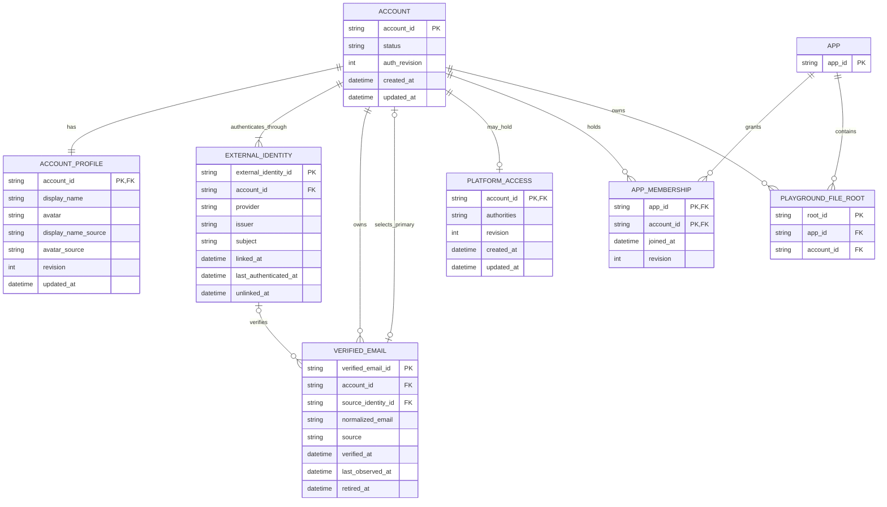
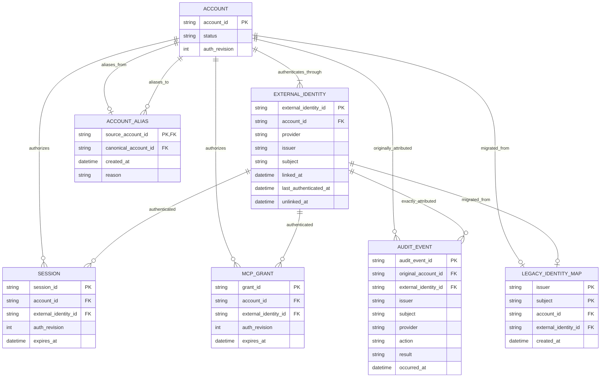

# Business and data model review

Status: Pending approval

## Decision requested

Approve the stable Account model, relationship ownership, verified-email
evidence rules, profile precedence, migration and rollback design, retained audit
attribution, future Merge compatibility, and retention rules below. Approval
allows implementation of these model and persistence changes; it does not
approve the separate architecture or interface artifacts.

## Current state

The current administrator key is `(identityIssuer, subject)` throughout the
wire model, platform access, App membership, encrypted sessions, Playground
ownership, idempotency, and audit. `Profile.emailForDisplay` is display-only,
but App and platform invitation admission currently compares that field with an
email constraint. Relevant owners are:

- `/packages/admin-protocol/src/types.ts`
- `/packages/service/src/control-plane.ts`
- `/packages/service/src/control-admin.ts`
- `/packages/service/src/platform-invitations.ts`
- `/packages/service/src/control-validation.ts`
- `/packages/service-cloudflare/src/control-schema.ts`
- `/packages/service-cloudflare/src/control-admin-repository.ts`
- `/packages/service-cloudflare/src/platform-access-repository.ts`
- `/packages/service-cloudflare/src/admin-bff/session.ts`

The migration must replace that ownership key without treating a matching email
as identity continuity.

## Target model

The target ER model is shown in two views so relationship cardinalities remain
legible. `ACCOUNT` and `EXTERNAL_IDENTITY` refer to the same entities wherever
they are repeated.

### Account and authorization relationships



### Credential, audit, and compatibility relationships



The views show durable domain and compatibility relationships. Request-scoped
`VerifiedEmailEvidence` is intentionally not an entity; email challenges,
one-time continuations, and migration-journal rows are operational records
described in the later persistence and migration sections.

### Account

`Account` is the durable authorization and ownership subject.

| Field | Rule |
| --- | --- |
| `accountId` | Opaque UniCAS-generated 128-bit identifier with an `acct_` wire prefix; never derived from provider or email data. |
| `status` | `active`, `blocked`, or reserved `merged`. `merged` has no write path in this task. |
| `authRevision` | Monotonic optimistic-concurrency and session-revocation generation. |
| `createdAt`, `updatedAt` | Server timestamps. |

Every authenticated administrator resolves to one canonical `accountId` before
admission or authorization. Blocking the Account denies all linked identities,
BFF sessions, CLI sessions, and MCP grants. Effective admission is:

```text
canonical Account is active
AND (PlatformAccess has an authority OR Account has an active AppMembership)
```

A blocked Account remains the owner of memberships and audit history; blocking
never transfers or deletes them.

### ExternalIdentity

An ExternalIdentity is an authentication fact, not an authorization grant.

| Field | Rule |
| --- | --- |
| `externalIdentityId` | Opaque internal identifier. |
| `accountId` | Account owning this link at this point in its history. |
| `provider` | `google`, `microsoft`, or `github`. |
| `issuer`, `subject` | Exact verified provider values; the active pair is globally unique. |
| `linkedAt`, `lastAuthenticatedAt` | Server timestamps. |
| `unlinkedAt` | Null for an active link; retained when unlinked for audit attribution. |

A partial unique index on `(issuer, subject)` where `unlinkedAt IS NULL` prevents
one identity from belonging to two Accounts. Provider login names, email, UPN,
`preferred_username`, and GitHub login are excluded from keys. GitHub `subject`
is the decimal string form of the numeric `/user.id`; Microsoft uses the
verified pairwise `sub` from the configured `consumers` issuer.

Unlinking closes the link rather than deleting it. It requires a fresh
successful authentication, optimistic concurrency on `authRevision`, and at
least one other usable active identity. It changes neither memberships nor the
Account's historical identity.

### Profile

Profile is mutable Account-level display data:

| Field | Rule |
| --- | --- |
| `displayName` | Nullable display value. |
| `avatar` | Nullable, sanitized HTTPS provider image reference or user-selected value. |
| `displayNameSource`, `avatarSource` | `user` or an `externalIdentityId`, retained to apply precedence. |
| `updatedAt`, `revision` | Server timestamp and optimistic-concurrency revision. |

Precedence is deterministic:

1. A user-edited Account value wins and is never overwritten by provider login.
2. A provider may fill an empty value.
3. A provider may refresh a value only when that same ExternalIdentity remains
   its source.
4. Linking another provider never replaces an existing nonempty value.
5. Unlinking a source clears that provider-owned value, then fills it from the
   most recently authenticated remaining identity if available.

Provider avatar URLs must be HTTPS and pass a provider-specific host policy.
The UI uses `Referrer-Policy: no-referrer`. When no avatar exists, the Account
projection returns server-derived initials and a palette index computed from
`accountId`; this is deterministic and does not use email.

### VerifiedEmail

VerifiedEmail is an Account attribute with provenance, not an identity key.

| Field | Rule |
| --- | --- |
| `verifiedEmailId` | Opaque internal identifier. |
| `accountId` | Owning Account. |
| `normalizedEmail` | Exact `trim().toLowerCase()` result. No provider-specific canonicalization. |
| `source` | `google-oidc`, `github-emails-api`, or `unicas-email-challenge`. |
| `sourceIdentityId` | External identity involved when applicable. |
| `verifiedAt`, `lastObservedAt` | Verification and latest observation times. |
| `retiredAt` | Optional removal from current profile projection; history remains available to retained audit evidence. |

Email is not globally unique. Two Accounts may hold the same normalized address
and remain separate. The service persists only provider-verified addresses that
are selected as primary contact or used for the current invitation; it does not
persist GitHub's unverified/private list as a profile dump. A primary contact is
selected from non-retired VerifiedEmail rows and may be changed explicitly.

A stored VerifiedEmail proves a historical verification event but is not by
itself fresh invitation evidence.

Ordinary and platform-list projections expose only the current primary verified
email. The self Account view lists current, non-retired addresses; retired rows
and historical evidence are never returned by general APIs. No compatibility or
new route accepts email as an Account selector.

### Invitation evidence

`ControlPlaneCallContext` gains the stable Account and exact login identity plus
zero or more short-lived evidence records:

```text
VerifiedEmailEvidence {
  normalizedEmail,
  source,
  verifiedAt,
  expiresAt,
  authenticationEventId
}
```

Invitation acceptance requires an unexpired evidence record matching only the
stored normalized invitation address. Evidence is produced as follows:

- Google: a freshly validated ID token with `email_verified=true`.
- GitHub: the callback access token is used immediately to call `/user` and
  `/user/emails`; only an entry with `verified=true` is evidence.
- Personal Microsoft account: token `email` and `preferred_username` are hints
  only. A short-lived UniCAS email challenge to the exact invitation address
  creates evidence after successful verification.

The invitation and evidence are consumed in one service transaction. Display
profile fields, old sessions, stored VerifiedEmail rows, public GitHub email,
unverified addresses, and stale evidence cannot pass this gate.

### Authorization relationships

`PlatformAccess` and `AppMembership` store `accountId` only, plus their own
state. They do not copy issuer, subject, email, display name, or avatar.

- `PlatformAccess`: `accountId`, authorities, revision, timestamps.
- `AppMembership`: `(appId, accountId)`, joined timestamp, revision if needed.
- `PlaygroundFileRoot`: `(appId, accountId, rootId)` ownership.
- Idempotency scopes use canonical `accountId`.

Platform People and App Members join the same Account summary projection. The
ordinary projection contains `accountId`, primary verified email, display name,
and avatar or fallback. Only self-service and privileged identity-management
reads expose linked ExternalIdentity summaries.

### Audit attribution

New security-sensitive audit events store all of:

- the original `accountId` used by the session;
- `externalIdentityId`, exact issuer, subject, and provider;
- action, target, result, request/correlation metadata, and timestamp;
- canonical Account resolution at read time, not by rewriting the event.

Provider tokens, email challenge values, invitation tokens, private email lists,
and raw callback payloads are never stored in audit details or logs. Existing
immutable audit rows are not updated. Their exact issuer/subject resolves through
the permanent migration mapping described below.

## Future Merge compatibility

This task creates no Merge or unmerge operation. The model reserves:

```text
AccountAlias { sourceAccountId, canonicalAccountId, createdAt, reason }
```

A future irreversible Merge may set the source Account to `merged` and insert
one immutable alias to the survivor. Canonical resolution follows aliases with a
small fixed depth, rejects cycles or missing targets, and fails closed. Source
Accounts, identity-link history, and original audit `accountId` values are never
deleted or reused. Authorization uses the canonical Account; historical reads
continue to show original attribution.

## Persistence mapping

The Cloudflare adapter adds account-owned tables and indexes alongside the
legacy tables:

- `cas_accounts`
- `cas_account_aliases`
- `cas_external_identities`
- `cas_account_profiles`
- `cas_verified_emails`
- `cas_identity_migration_journal`
- account-keyed platform access and App membership tables or additive
  `account_id` columns during transition
- `account_id` on Playground roots and session metadata
- hashed email-challenge and one-time continuation records

Table constraints enforce active identity uniqueness, one profile per Account,
relationship uniqueness, challenge expiry/consumption, and optimistic
concurrency. D1 transactions own identity linking, unlinking, invitation
acceptance, session revision, and relationship mutations.

## One-to-one migration

Migration is additive, idempotent, and restartable:

1. Create the Account tables, compatibility mapping, indexes, and nullable
   account references. Do not drop or rename legacy columns.
2. Build a permanent migration map for every distinct legacy `(issuer, subject)`
   found in platform principals, App members, operator identities, ownership
   inputs, and audit actors/targets. `INSERT OR IGNORE` assigns exactly one
   random Account to each pair. Never group by email.
3. Create one active ExternalIdentity per mapped pair. Seed Profile display data
   from `cas_operator_identities`, recording it as legacy/provider display data.
   Do not create VerifiedEmail from `email_for_display` because its provenance
   was not persisted.
4. Backfill PlatformAccess and AppMembership by the permanent map. Preserve
   authorities, blocked state, membership timestamps, and revisions.
5. For every Playground root, recompute each legacy owner key from its App and
   mapped identity, then set `account_id`. Fail migration if an owner cannot be
   mapped or maps ambiguously; never orphan or reassign it.
6. Leave existing audit rows byte-for-byte unchanged. Audit projection uses the
   permanent map for old events; new events write Account plus identity evidence.
7. Record each schema, relationship, Playground, session, and MCP-grant migration
  stage in an idempotent journal with source counts, mapped counts, failures,
  and completion time. The journal contains no tokens or email lists.
8. Run shadow comparisons for Account and legacy reads. Any count, authority,
   membership, ownership, or projection mismatch blocks cutover.
9. Switch authorization and ownership reads to Account while Google remains the
   only enabled provider. Rotate legacy sessions on use.
10. After the compatibility window and production reconciliation pass, enable
   Microsoft, GitHub, linking, and unlinking. Destructive legacy cleanup is a
   later separately reviewed migration.

### Session transition

The encrypted payload remains readable by the previous deployment during the
pre-provider compatibility window: existing v1 identity fields stay present and
additive Account fields carry `accountId`, exact ExternalIdentity, fresh-auth
time, and `authRevision`. A legacy session is resolved through the permanent map
and immediately rotated to the Account form. Unknown, ambiguous, blocked, or
revision-mismatched sessions fail closed.

Session table metadata adds `account_id` and `auth_revision` so all browser and
CLI sessions for an Account can be revoked. MCP grants carry the same Account
and revision and are checked on every request within the existing revocation
bound. Existing remote MCP grant records are migrated server-side through the
same permanent map while retaining their legacy identity fields; unmapped or
ambiguous grants are revoked. A migrated browser/CLI session may read only long
enough to rotate, and must rotate before any mutation. Credential migration
counts and failures are part of the migration journal and cutover gate.

## Rollback and deployment gate

Rollback has two distinct limits:

- Before Microsoft/GitHub or linking is enabled, deployment may return to the
  legacy read path. Additive tables remain, legacy columns are still dual-written,
  and compatible Google sessions retain legacy identity fields.
- After any multi-provider identity is linked or used for account-owned data,
  rolling back to identity-keyed authorization would split one Account into
  multiple Principals. That rollback is forbidden. Operators disable new login,
  linking, and challenge mutations, preserve Account reads, and roll forward.

The rollout therefore uses a server-side stage flag: `legacy`, `shadow`,
`account-google`, then `multi-provider`. Advancing requires reconciliation and
session tests; the final transition is explicitly recorded as the rollback
boundary. Database backup/export and a dry-run migration report are required
before production schema mutation.

## Retention and redaction

- Provider authorization codes and access/refresh/ID tokens are never persisted.
  GitHub access tokens live only long enough to call `/user` and `/user/emails`.
- Email challenge codes are generated cryptographically, stored only as hashes,
  expire after 10 minutes, are single-use, and are pruned within 24 hours.
  Attempt counters and generic outcome metadata may be retained for 30 days.
- Pre-login and linking continuations expire after 10 minutes and are single-use.
- VerifiedEmail stores only normalized address plus provenance needed for contact
  and audit. Unverified/private provider email lists are never persisted or
  logged.
- Retired VerifiedEmail plaintext is removed within 30 days unless it remains
  the selected primary contact. When immutable evidence must outlive that
  window, retain only a keyed digest, source, and timestamps; general reads can
  neither recover nor search the retired address.
- Provider display values remain while selected by the Account profile; values
  sourced only from an unlinked identity are cleared or replaced by precedence.
- External identity link history and Account aliases follow immutable security
  audit retention because deleting them would destroy attribution. Public and
  ordinary API responses expose only active summaries.
- Existing audit retention policy continues; secrets and raw provider payloads
  are always redacted before structured logging.

## Required validation

Implementation evidence must include:

- one-to-one migration fixtures with duplicate emails and no merges;
- count, authority, membership, Playground ownership, and audit reconciliation;
- restart/idempotency and rollback-window tests;
- legacy session rotation and all-account revocation tests;
- duplicate-email separation and identity-link conflict tests;
- final-identity unlink denial and optimistic-concurrency tests;
- fresh, stale, absent, mismatched, unverified, and display-only email evidence;
- future alias canonicalization, cycle, missing-target, and immutable-audit tests;
- redaction tests proving provider tokens, challenge values, invitation tokens,
  and private email lists do not reach responses, URLs, logs, or audit details.

## References

- [Task](./Task.md)
- [Google OpenID Connect](https://developers.google.com/identity/openid-connect/openid-connect)
- [Microsoft ID token claims](https://learn.microsoft.com/en-us/entra/identity-platform/id-token-claims-reference)
- [GitHub OAuth authorization](https://docs.github.com/en/apps/oauth-apps/building-oauth-apps/authorizing-oauth-apps)
- [GitHub Emails API](https://docs.github.com/en/rest/users/emails)
