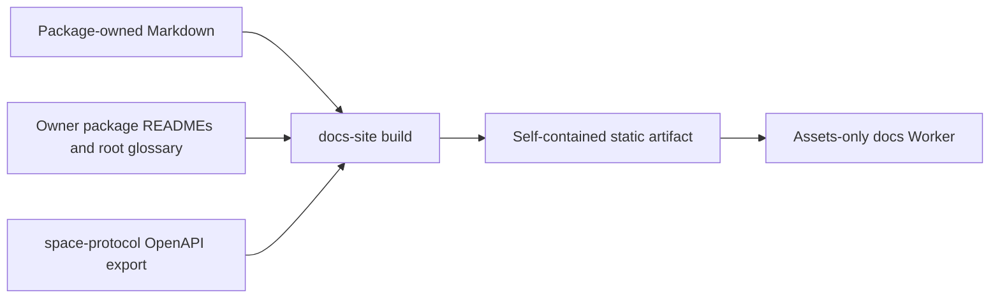

# Documentation package architecture review

Status: Awaiting architecture approval.

## Decision requested

Approve a private `@unicas/docs-site` workspace package that owns the renderer,
route manifest, published content, browser assets, tests, generated artifact,
and assets-only Cloudflare configuration. The workspace root retains concise
delegating commands and CI orchestration only.

Approval permits creating the package, moving current site ownership out of
`stacks/unicas/docs-site/` and root tests, updating workspace dependencies and
CI, and moving content according to [ContentInventory.md](./ContentInventory.md).
It does not authorize a UI redesign, public route change, API contract change,
npm publication, or production deployment outside the existing release flow.

## Ownership boundary

```text
packages/docs-site/
|-- package.json              # private @unicas/docs-site package and commands
|-- README.md                 # package purpose, inputs, outputs, and operation
|-- content/                  # canonical published Markdown owned by the site
|-- src/                      # route manifest, renderer, link validation, build
|-- static/                   # CSS, browser JS, API-reference entry, favicon
|-- tests/                    # package, route, artifact, and responsive checks
|-- tsconfig.json             # workspace reference and package typecheck boundary
|-- wrangler.jsonc            # assets-only docs.unicas.work deployment
`-- dist/                     # ignored deterministic deployment artifact

docs/
|-- README.md                 # repository-documentation boundary and index
|-- repository-tasks.md       # contributor workflow
`-- managed-issuer-retirement.md # historical release-engineering procedure
```

The package is a deployment unit, not a public library. Its directory and
package name obey the repository's one-to-one naming rule. `/packages/README.md`
will list it as a private deployment package and document that its only UniCAS
package input is the generated Space OpenAPI contract.

## Dependency boundary



The package directly declares all tools it invokes:

| Dependency | Role |
| --- | --- |
| `@unicas/space-protocol` | Workspace build input exposing `./openapi.json`; no source-relative cross-package read. |
| `marked` | Markdown rendering. |
| `esbuild` | Browser API-reference bundling. |
| `@scalar/api-reference` | Interactive OpenAPI presentation bundled into static assets. |
| `vitest` | Package-local behavior and artifact tests. |
| `wrangler` | Package-local deployment plan and deployment command. |
| `rimraf` | Cross-platform package clean command. |
| TypeScript and Node types | Workspace typecheck boundary for package source. |

The builder resolves `@unicas/space-protocol/openapi.json` through the package
export and copies its tracked bytes. It does not import service, Cloudflare
adapter, admin, storage, OAuth, or `@unidocs/*` code. Workspace-boundary checks
will recognize and enforce this declared build-time package input.

## Package commands and root delegation

| Package command | Responsibility | Root delegation |
| --- | --- | --- |
| `build` | Clean and generate the complete static artifact. | `docs:build` filters `@unicas/docs-site`. |
| `test` | Run package-local route, link, artifact, OpenAPI, and responsive tests. | `docs:check` filters `@unicas/docs-site`. |
| `typecheck` | Check package source and tests. | Included by workspace `typecheck`. |
| `clean` | Remove package output and build metadata. | Included by workspace `clean`. |
| `deploy` | Build and deploy with the package-owned Wrangler config. | `deploy:docs` delegates to the package. |
| `deploy:plan` | Build and run credential-free `wrangler deploy --dry-run`. | `deploy:docs:plan` delegates to the package. |

Root dependencies used only by the site move to the package manifest. Root
scripts contain no renderer paths, test paths, Wrangler config paths, or tool
selection. CI invokes the package boundary directly for build, test, typecheck,
and deployment-plan evidence while retaining repository-wide checks.

## Build inputs and artifact

The route manifest is the single explicit inventory for every rendered page.
Each entry contains `route`, `title`, `navigation`, `sourcePath`, `sourceOwner`,
and `lifecycle`. Generated pages identify their generator or package-owned input
instead of inventing a Markdown source.

One clean build performs this sequence:

1. remove and recreate `packages/docs-site/dist/`;
2. load the reviewed route manifest and canonical Markdown or owner-rendered
   inputs;
3. render pages with the existing heading slugger, navigation, and link
   rewriting behavior;
4. copy browser assets and the exported App/Space v1 OpenAPI document;
5. bundle the existing Scalar API-reference entry;
6. emit the overview, 404 page, link-check result, and artifact manifest; and
7. fail on a missing source, duplicate route, duplicate source authority,
   unresolved internal route or fragment, stale edit link, or unexpected file.

The artifact manifest is deterministic apart from an explicitly supplied
source revision. It contains only:

```json
{
  "schemaVersion": 1,
  "package": { "name": "@unicas/docs-site", "version": "0.1.0" },
  "sourceRevision": null,
  "pages": [
    {
      "route": "/cas-architecture/",
      "title": "CAS Architecture",
      "navigation": "Architecture",
      "sourcePath": "packages/docs-site/content/cas-architecture.md",
      "lifecycle": "published-service-standard"
    }
  ],
  "openapi": {
    "path": "openapi/app-space-v1.openapi.json",
    "sha256": "<lowercase hex digest>"
  },
  "linkCheck": "link-check.json"
}
```

`sourceRevision` is `null` unless CI explicitly supplies a validated Git commit.
The build records no timestamp, local absolute path, environment dump,
credential, bearer material, private key, or customer data. Tests compare two
clean local builds for deterministic files when provenance input is unchanged.

## OpenAPI authority

`@unicas/space-protocol` remains the sole machine-readable contract owner. Its
existing generation and drift checks run before or alongside the docs package
build. The docs package:

- declares the protocol package as a build-time workspace dependency;
- resolves only its exported `./openapi.json` artifact;
- copies the exact artifact into the static output;
- records a SHA-256 digest in the artifact manifest; and
- fails if the copied bytes, digest, or interactive-reference URL drift.

No schema is copied into docs-site source, generated from prose, or maintained
by the renderer.

## Deployment isolation

The package-owned Wrangler configuration preserves the current deployment
contract:

- Worker name `unicas-docs`;
- exact custom domain `docs.unicas.work`;
- `workers_dev: false` and `preview_urls: false`;
- assets directory `./dist`;
- `html_handling: "auto-trailing-slash"`;
- `not_found_handling: "404-page"`; and
- no `main`, service binding, D1, R2, KV, Durable Object, queue, OAuth, variable,
  secret, compatibility flag, or API route.

Repository deployment tests parse this config and reject API, data-plane,
administrator, OAuth, storage, or secret bindings. Production deployment stays
in the protected release job after service, Spaces, and product-site steps; the
task performs no standalone production deployment.

## Validation and CI

Focused package checks cover:

- all 24 reviewed pages, stable routes, navigation labels, headings, anchors,
  edit links, assets, OpenAPI download, and 404 behavior;
- complete manifest/source classification with no untracked Markdown input;
- generated links and fragments, including links from moved content and
  owner-rendered references;
- exact OpenAPI copy and digest plus the existing protocol drift check;
- clean artifact allowlist, deterministic rebuild, and absence of secrets or
  local absolute paths;
- workspace dependency and package-name boundaries;
- desktop and mobile navigation/API-reference behavior using the existing
  browser-check approach; and
- credential-free Wrangler dry-run against the package-owned config.

Repository checks additionally scan maintained links and source-edit targets so
no reference to a moved public document or former site implementation survives.
CI calls the package commands explicitly and then runs the normal build,
typecheck, exhaustive tests, and deployment plans.

## Implementation order

1. Add the package manifest, explicit route/content manifest, build ownership,
   static assets, tests, Wrangler config, and package commands without changing
   routes.
2. Run the package build and route/link tests against the current source paths.
3. Move the 17 published Markdown sources and the Spaces operations guide,
   update canonical source metadata, and add the repository docs index.
4. Update every maintained repository link, source-edit assumption, package
   boundary, root delegation, CI check, and deployment test.
5. Add artifact provenance, deterministic/clean-output checks, OpenAPI digest
   checks, responsive browser evidence, and Wrangler dry-run.
6. Run focused package checks, repository checks, build, typecheck, exhaustive
   tests, and deployment-plan validation before delivery review.

Each stage uses a focused executable check before the next edit slice. The old
`stacks/unicas/docs-site/` and root docs-site test are removed only after their
package-owned replacements pass.

## Rejected alternatives

- **Keep public content under `/docs`:** leaves source ownership split and
  preserves the implicit root source directory the task exists to remove.
- **Copy package READMEs or OpenAPI into package source:** creates competing
  canonical documents or contracts.
- **Retain root-owned renderer dependencies and tests:** produces a package in
  name only and prevents direct package validation.
- **Keep Wrangler configuration under `/stacks`:** splits ownership of this
  assets-only deployment after the task explicitly assigns it to the package.
- **Add redirects preemptively:** introduces a new public interface despite
  every existing route being preserved.
- **Bundle the docs into the API or Console Worker:** violates the accepted
  deployment and credential-isolation boundary.

## Review question

Approve this private package boundary, direct dependency and command model,
deterministic artifact contract, OpenAPI authority, CI integration, and
assets-only deployment isolation?