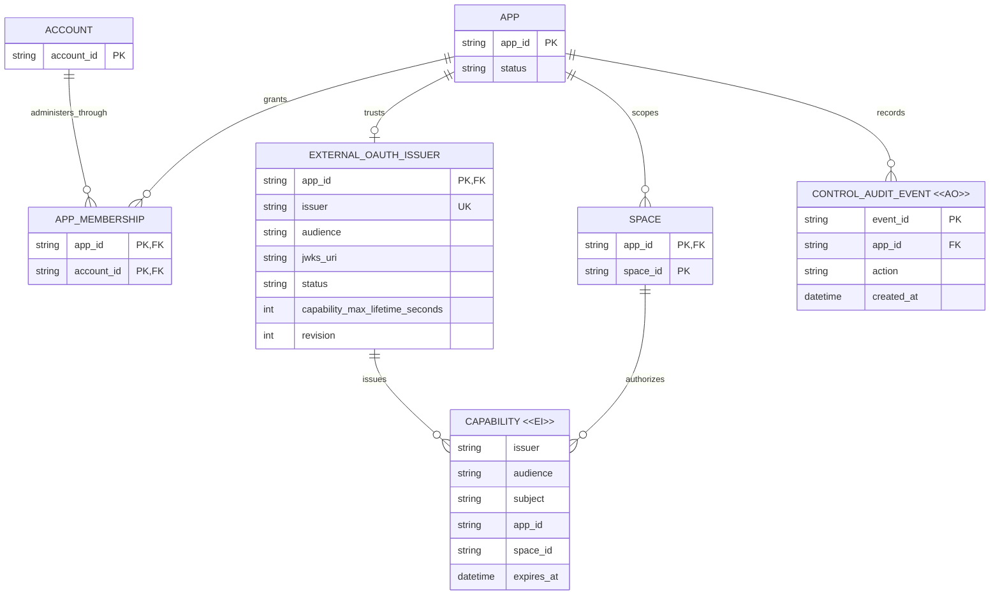

# Business and data model review

Status: Approved by the requesting user on 2026-09-20 for primary commit
`6c831d7`.

## Decision requested

Approve these target business rules:

- An App may have one standard external OAuth issuer; UniCAS owns no managed
  issuer and derives no Space identity from an administrator Account.
- Space identity and capability issuance belong to the external application and
  issuer. App membership grants management access only.
- Legacy managed issuer rows and signing material are retirement inputs, not
  target entities. Their production deletion occurs only after issuance is
  stopped, 3,660 seconds have elapsed, and a human explicitly approves cleanup.

Approval permits the persistence and mapping changes described here. It does
not approve the separate architecture or interface proposals.

## Material changes

| Current | Proposed | Why |
| --- | --- | --- |
| Each new App may atomically receive a `cas_app_managed_issuers` row. | App creation writes only the App, creator membership, idempotency record, and audit event. | App administration must not create an authorization server. |
| A managed signer derives `spaceId` and `refDomain` from `(App, Account)` and issues a one-hour capability. | UniCAS has no durable or derived `(App, Account) -> Space` relationship. The external application chooses Space mapping and asks its configured issuer to issue capabilities. | App membership is management authority, not Space data authority. |
| Runtime authority resolution unions external and managed issuer tables. | Runtime authority resolution reads only the App's active external issuer. | One supported issuer model removes hidden fallback authority. |
| Managed issuer rows and one deployment signing key are active operational state. | They are retained only during the retirement drain, then removed by an explicitly approved production operation. | Existing bearer tokens need their issuer/JWKS verification boundary until expiry. |
| Historical audit events may name managed issuer actions. | Historical audit events remain append-only and readable; no new managed issuer events are emitted. | Retirement must not rewrite attribution history. |

## Target model

`SPACE` denotes the existing data-plane identity. This change does not add,
delete, migrate, or reinterpret Space rows, Root Refs, nodes, content, leases,
usage, or garbage-collection state. `CAPABILITY` is a signed request credential,
not a UniCAS persistence row.

The target deliberately contains no relationship from `ACCOUNT` or
`APP_MEMBERSHIP` to `SPACE`. Applications may implement such a relationship in
their own domain, but UniCAS neither stores nor derives it.

## Lifecycle semantics

| Entity | What can change | How validity ends | Deletion |
| --- | --- | --- | --- |
| External OAuth issuer | Discovery snapshot, status, and revision change only through the existing inspect/prove/activate workflow. | Replacement, disablement, App suspension, or verifier rejection. | Existing external-issuer operations and retention rules remain unchanged. |
| `CAPABILITY <<EI>>` | Nothing after signing. | `exp`, App suspension, issuer removal/replacement, or verification failure. | Not persisted by UniCAS. |
| `CONTROL_AUDIT_EVENT <<AO>>` | Nothing after append. | It remains historical evidence even when the referenced feature is retired. | Existing audit retention policy only; this task does not purge it. |
| Legacy managed issuer row | Read-only during the drain; no enable, disable, provisioning, or issuance mutation. | Final runtime removal after the drain boundary. | Manual production approval is required after at least 3,660 seconds. |
| Legacy managed signing key | Read-only verification material during the drain; no new signatures. | Final route/verifier removal after the drain boundary. | Manual production approval is required before secret revocation or deletion. |

## Governing invariants

1. App membership authorizes control-plane administration only and never implies
   ownership of, access to, or a deterministic identity for a Space.
2. An App has at most one configured external issuer, and an issuer string is
   globally unique across Apps under the existing activation transaction.
3. App creation never depends on issuer signing material and never creates an
   issuer record.
4. New managed tokens stop before any managed verification material is removed.
5. The minimum drain is the current 3,600-second managed token lifetime plus the
   60-second verifier hard stale boundary: 3,660 seconds from the confirmed
   production issuance cutoff.
6. Existing Space/CAS state and append-only audit history are not migration
   inputs and are not deleted or rewritten.

## Persistence and migration impact

The final code removes `cas_app_managed_issuers` and
`cas_managed_issuers_by_status` from schema bootstrap definitions and removes
all repository reads/writes. That is not a destructive production migration:
an existing D1 database may retain the now-unreferenced table and index.

Production retirement is one way:

1. Deploy the issuance-freeze revision and verify that App creation, Admin API,
   BFF, and MCP cannot issue or re-enable managed capabilities.
2. Record the production cutoff timestamp. Keep the managed rows, public
   metadata/JWKS route, authority resolution branch, and signing key available
   only for verification.
3. Wait at least 3,660 seconds.
4. Obtain explicit human approval for the production cleanup window.
5. Deploy the final removal revision.
6. Separately drop the legacy index/table and revoke/delete the signing secret.
   Each destructive operation is operator-executed and is not run by this task.

Rollback before step 5 is deployment rollback to the issuance-freeze revision,
which still verifies drained tokens but does not resume issuance. Rollback after
row/key deletion cannot restore managed tokens and therefore requires separately
retained, approved recovery material; the runbook will not present re-enabling
managed issuance as a supported rollback.

## Open decisions

None. The task scope fixes the 3,660-second minimum and requires explicit human
approval for production data or key destruction.
