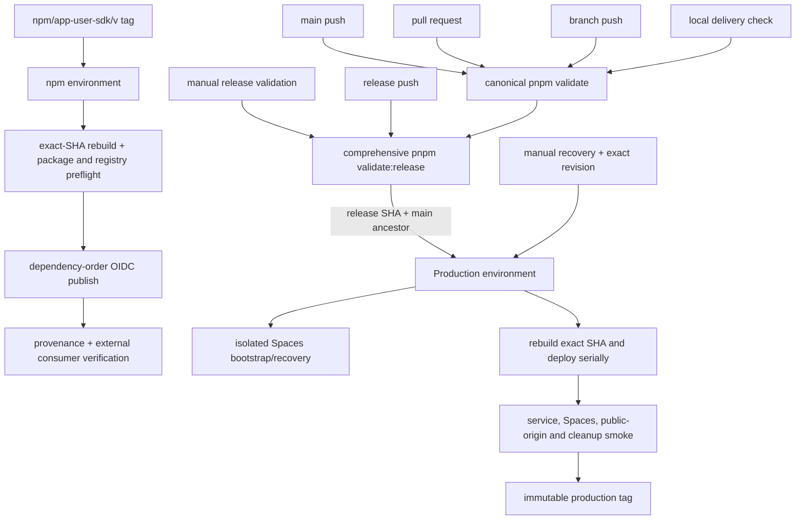

# 验证与发布架构评审

Updated: 2026-09-23
Status: Approved

Approved: 2026-09-23（用户明确批准 Architecture）

## 基线方法

所有前后对比使用同一方法：

- GitHub wall time：workflow `createdAt` 到 `updatedAt`；
- runner time：各 job `startedAt` 到 `completedAt` 之和，environment approval 和
  runner queue 单独记录；
- functional step：排除 `Set up job`、`Complete job` 和自动生成的 `Post ...`；
- 重复执行：按 install、test、build、typecheck、pack、dry-run、smoke、registry
  preflight 的实际调用次数计数，不按不同 step 名称推断；
- 本地命令以同一 checkout、已安装依赖和同一 Windows 主机连续运行三次，记录中位数；
- GitHub 对比使用同一 trigger 类型最近三个成功 run 的中位数，并保留 run URL 和 SHA。

2026-09-23 的可复现起点如下：

| 路径与证据 | job/functional step | 关键时间 | 已确认重复或历史债 |
| --- | --- | --- | --- |
| `main` run [35826820712](https://github.com/shazhou-ww/unicas/actions/runs/35826820712), SHA `91b4812f89f844e85d2e73ca279ff0c2a81d5a72` | 1 个执行 job、3 个 skipped job、19 个 functional steps | wall 4m49s；validate runner 4m45s；穷尽测试 2m23s；SDK pack/check 41s；文档 test/build/typecheck 23s；四个 deployment build 9s | 穷尽测试之后再次单独执行 SDK、文档、build/typecheck 和 deployment build；所有 branch push 都承担同一成本 |
| `release` run [35698043906](https://github.com/shazhou-ww/unicas/actions/runs/35698043906), SHA `7b3a557e73f82b9635637ccd38110644b6feb29e` | 3 个执行 job、1 个 skipped bootstrap job；validate 19、deploy 19、tag 2 个 functional steps | wall 10m23s；runner 合计 7m28s；validate 3m56s；deploy 3m25s；tag 7s | 正常 deploy 保留两个已完成 v1 issuer cutover skipped steps；正常 workflow 仍暴露 Spaces bootstrap job |
| npm run [35800458882](https://github.com/shazhou-ww/unicas/actions/runs/35800458882), SHA `45c1681e2cfb071ffcc2be694bae48ad2e267514` | 2 个执行 job、17 个 functional steps | wall 2m36s；validate runner 39s；publish runner 1m22s，另有 environment/queue 等待 | 两次 checkout/setup/install/fetch；两次六包 artifact build/check；两次全量 registry preflight；publish loop 内另有必要的即时状态检查 |

## 目标执行图

## 职责与复用

1. **脚本拥有检查，workflow 只编排。** Root/package scripts 定义可在 Windows 和
   Linux 执行的检查集合；workflow 负责 trigger、权限、environment、concurrency
   和精确 SHA。workflow 不复制脚本内部命令序列。
2. **普通 CI 只有一个可本地复现的测试集合。** 本地交付检查、branch、PR 和
   `main` 都调用 `pnpm validate`，不根据 GitHub event 维护不同 test cases。
   `release` 调用严格包含它的 `pnpm validate:release`，增加低频、慢速和外部发布
   边界验证，而不是改变普通 CI 已检查断言的语义。
3. **同一信任域内只生成一次。** 完整只读门禁中的 build、typecheck、docs 和 SDK
   artifact check 各调用一次。npm protected job 中六包只重建一次。
4. **不跨信任边界复用可执行产物。** Production job 从批准的 release SHA 重建；
   npm job 从批准的 tag SHA 重建。PR、branch 和普通 `main` job 的 bundle/tarball
   不进入外部写入 job。这里的重复新增了 environment 与精确 revision 保证，必须保留。
5. **只缓存可再验证的依赖。** 继续使用 pnpm store/cache；不缓存或跨 workflow
   传递 deployment bundle、SDK tarball、生成的 secret 文件或 smoke credential。

## 外部写入与失败关闭

- `ci.yml` 默认 `contents: read`。只有 production tag job 获得写 tag 所需权限；
  deploy job 只在 `Production` environment 内获得 Cloudflare secret。
- npm workflow 默认 `contents: read`，只有 protected publish job 获得
  `id-token: write`。禁止 `NPM_TOKEN` 和 `NODE_AUTH_TOKEN`。
- release job 在任何 secret 同步和 deploy 前检查 checkout SHA、`GITHUB_SHA`、
  `release` ref 及 `origin/main` 祖先关系。
- npm job 在任何 registry 写入前检查 tag grammar、tag/version 精确匹配、主分支
  可达性、六包集合、依赖顺序、tarball/manifest 和所有 registry 当前状态。
- npm 每包写入前仍重新读取该包版本状态。这不是重复全量 preflight，而是防止长序列
  中 registry 状态变化和支持部分成功后的安全重跑。
- smoke 或 cleanup 失败保持失败；清理重试不得覆盖主失败。production tag 只在全部
  deploy、origin、smoke 和 cleanup 成功后创建。

## 并发与恢复

- `release` promotion 和 Spaces recovery 共用一个不可取消的 production
  concurrency group，防止两个写入流程交错。
- branch/PR/read-only validation 按 ref 使用可取消 concurrency，新的 commit
  取消旧 run。
- npm 按规范 tag 使用不可取消 concurrency；重复触发依靠 registry 精确状态实现
  幂等，不覆盖版本或 dist-tag。
- Spaces bootstrap 的两种模式移出正常 CI，只能由 protected manual workflow
  到达。v1 issuer cutover 已完成且没有通用恢复价值，从可执行 workflow 删除。
- npm 首次 package record 创建保留为受控 onboarding 文档，不进入每次 tag 发布。

## 回归证明

将增加结构化 workflow/script 测试，至少证明：

- 普通 branch、PR、`main` 均调用同一 `pnpm validate`，`release` 和 manual
  release validation 调用其严格超集；
- normal workflow 无 bootstrap/cutover 写入口，恢复 workflow 只有
  `workflow_dispatch` 且使用 `Production` environment；
- 规范和非规范 npm tag 的接受/拒绝、唯一六包集合、依赖顺序、OIDC 权限和无 token；
- release 精确 revision/main ancestor/Production concurrency，以及 deploy 后
  smoke、cleanup、public origin、immutable tag 顺序；
- npm 所有写入前 preflight、已存在精确版本 skip、mismatch fail 和部分发布重跑；
- `pnpm validate`、部署 dry-run 和 planner 在 Windows 与 Linux 不依赖 shell 特有行为。

## 优化目标

GitHub 时长有 runner 波动，交付结论同时看操作次数和三次中位数，不以单次时间作为
唯一成功标准。

| 路径 | 结构目标 | 时间目标 |
| --- | --- | --- |
| branch / PR / `main` | 全部调用同一 `pnpm validate`；精简重复或只在发布前有价值的 test cases；build/typecheck 各一次 | runner 中位数至少降低 20%，本地与 CI 的标准命令结果一致 |
| `release` | `pnpm validate:release` 覆盖普通门禁的严格超集；删除 cutover steps 和可达 bootstrap job；保留 protected rebuild、deploy、smoke 和 tag | 全面 validation 成本单独记录；deploy 成本不以削弱 smoke 为代价 |
| npm tag | 一个 protected job；一次 install、artifact build 和全量 preflight | functional steps 至少降低 30%；environment 等待之外的 runner 中位数至少降低 25% |

## 请求决定

批准本架构表示接受普通 CI 使用统一可本地复现门禁、release 使用严格超集，以及
上述同信任域复用、跨信任域重建、权限、concurrency、失败关闭、恢复隔离、测量
方法和优化阈值。批准不授权生产部署、npm 发布或非零 production tracing sampling。
